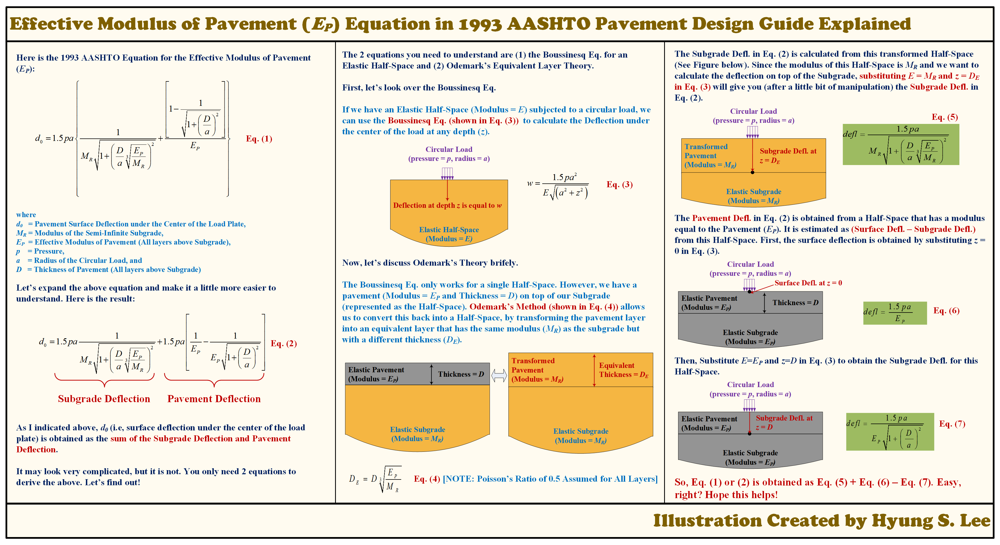

[← Back to Technical Illustrations](../index.qmd)

How the 1993 AASHTO effective pavement modulus equation can be understood using Boussinesq’s elastic half-space solution and Odemark’s equivalent layer theory.

::: {.illustration-viewer}
{target="_blank"}
:::

[**⬇ Download the original high-resolution PNG**](hyung-s-lee-1993-aashto-effective-pavement-modulus.png){download="hyung-s-lee-1993-aashto-effective-pavement-modulus.png" .btn .btn-primary}

*Click the illustration to open the full-resolution image in a new tab.*

[View Original LinkedIn Post](https://www.linkedin.com/posts/hyungsuklee_aashto-pavement-fallingweightdeflectometer-activity-7319712073561645056-twzP){target="_blank" rel="noopener noreferrer"}

### Technical note

The illustration separates the modeled surface deflection into subgrade and pavement contributions using two idealized elastic half-spaces. The resulting effective modulus is an approximate representation, not an exact multilayer elastic solution. The illustration assumes a Poisson’s ratio of 0.5.

**Illustration:** Hyung S. Lee, Ph.D., P.E. · Originally created 2025-04-20.

If you share or reproduce this illustration, please credit the author and link to this page.
