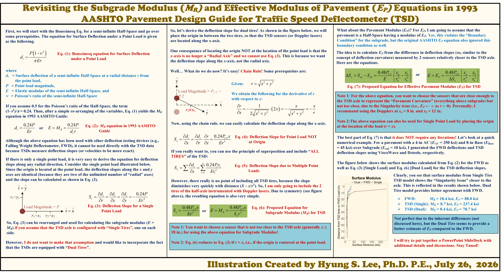

[← Back to Technical Illustrations](../index.qmd)

Proposed analytical equations for estimating subgrade and effective pavement moduli from Traffic Speed Deflectometer (TSD) deflection slopes, including dual-tire loading.

::: {.illustration-viewer}
{target="_blank"}
:::

[**⬇ Download the original high-resolution PNG**](hyung-s-lee-aashto-ep-for-tsd.png){download="hyung-s-lee-aashto-ep-for-tsd.png" .btn .btn-primary}

*Click the illustration to open the full-resolution image in a new tab.*

[View Original LinkedIn Post](https://www.linkedin.com/feed/update/urn:li:activity:7487273233688387584/){target="_blank" rel="noopener noreferrer"}

### Technical note

The slope-based expressions shown are the author’s proposed formulations, not equations prescribed by the 1993 AASHTO Guide. The illustration discusses dual-tire loading, sensor position, and assumptions underlying the estimates.

**Illustration:** Hyung S. Lee, Ph.D., P.E. · Originally created 2026-07-26.

If you share or reproduce this illustration, please credit the author and link to this page.
