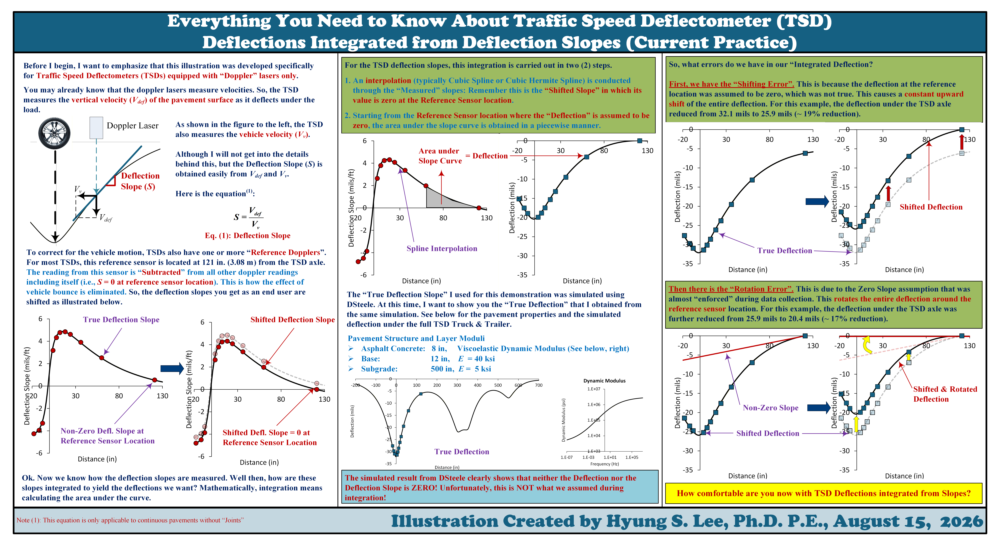

[← Back to Technical Illustrations](../index.qmd)

An illustrated explanation of how deflection slopes are integrated and how reference-sensor assumptions can introduce shifting and rotation errors.

::: {.illustration-viewer}
{target="_blank"}
:::

[**⬇ Download the original high-resolution PNG**](hyung-s-lee-tsd-integration.png){download="hyung-s-lee-tsd-integration.png" .btn .btn-primary}

*Click the illustration to open the full-resolution image in a new tab.*

[View Original LinkedIn Post](https://www.linkedin.com/feed/update/urn:li:activity:7494501703887699968/){target="_blank" rel="noopener noreferrer"}

### Technical note

This illustration specifically addresses Doppler-laser TSD systems and shows how the selected reference location and zero-slope assumptions can affect integrated deflections. The numerical demonstration is simulation-based.

**Illustration:** Hyung S. Lee, Ph.D., P.E. · Originally created 2026-08-15.

If you share or reproduce this illustration, please credit the author and link to this page.
