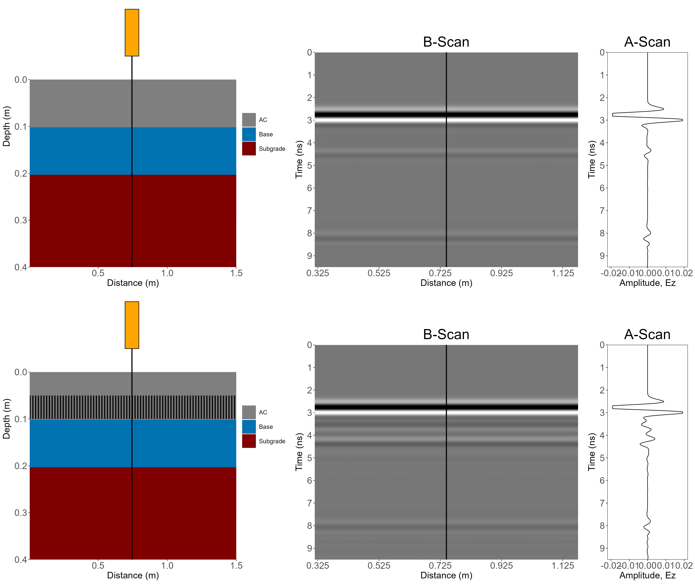
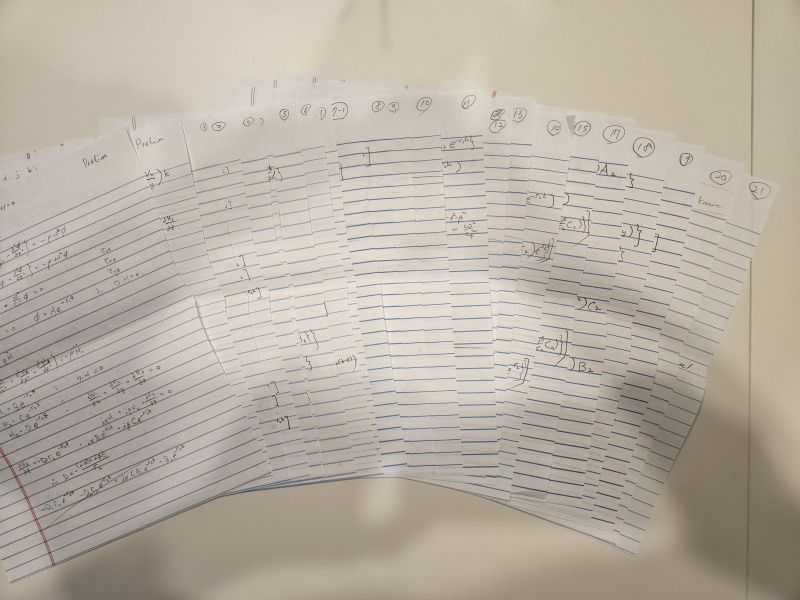

::: {.hero-home}
::: {.hero-copy}
::: {.hero-kicker}
PAVEMENT ENGINEERING · COMPUTATIONAL RESEARCH
:::

# Hyung S. Lee, Ph.D., P.E.

::: {.hero-subtitle}
Pavement Engineering · Computational Mechanics · Nondestructive Testing · Dynamic & Viscoelastic Modeling · Vehicle-Pavement Interaction · Developer of ViscoWave, DSteele, and Finite Beam Method
:::

I develop mechanics-based computational models and numerical tools to study pavement response, moving-load behavior, nondestructive testing, and infrastructure evaluation.

::: {.hero-actions}
[Explore Research](#featured-research){.btn .btn-primary .btn-lg}
[Models & Software](#models-software){.btn .btn-outline-primary .btn-lg}
:::
:::

::: {.hero-photo}
{fig-alt="Professional headshot of Hyung S. Lee"}
:::
:::

## Latest Technical Articles

::: {.featured-article}
::: {.featured-article-copy}
::: {.eyebrow}
GPR · GPR-01 · October 8, 2026
:::

### [Building a Virtual Ground Penetrating Radar (GPR) Laboratory with FDTD](posts/gpr-virtual-laboratory/index.qmd)

A virtual GPR laboratory using FDTD simulations to investigate how pavement layer interfaces, irregular thicknesses, cracks, water, thin asphalt layers, and subsurface voids affect the recorded radar response.

[Read GPR-01 →](posts/gpr-virtual-laboratory/index.qmd){.article-link}
:::

::: {.featured-article-media}
{fig-alt="FDTD simulation comparison of pavement structures and GPR responses"}
:::
:::

::: {.featured-article}
::: {.featured-article-copy}
::: {.eyebrow}
TSD · TSD-01 · October 6, 2026
:::

### [Four TSD Myths: Confirmed, Busted, or Plausible?](posts/tsd-four-myths/index.qmd)

Four common assumptions about Traffic Speed Deflectometer analysis are examined through moving-load mechanics, including FWD–TSDD correlation, slope integration, vehicle-model simplification, and slope-based backcalculation.

[Read TSD-01 →](posts/tsd-four-myths/index.qmd){.article-link}
:::

::: {.featured-article-media}
{fig-alt="Confirmed, Busted, and Plausible verdict graphic representing the four TSD myths"}
:::
:::

::: {.featured-article}
::: {.featured-article-copy}
::: {.eyebrow}
DSteele · DS-02 · October 3, 2026
:::

### [Mathematical Formulation of DSteele](posts/dsteele-mathematical-formulation/index.qmd)

The mathematical foundation of DSteele: governing equations, transformed-domain harmonic solutions, spectral-element stiffness matrices, viscoelastic representation, global assembly, and inverse transformation.

[Read DS-02 →](posts/dsteele-mathematical-formulation/index.qmd){.article-link}
:::

::: {.featured-article-media}
{fig-alt="Original handwritten mathematical derivation developed during the formulation of DSteele"}
:::
:::

## Featured Research {#featured-research}

::: {.home-card-grid}
::: {.home-card}
### [Traffic Speed Deflectometer (TSD)](research/tsd.qmd)

Pavement response under moving loads, TSD measurements, deflection slope, integration, and backcalculation.
:::

::: {.home-card}
### [Flexible Pavements](research/flexible-pavements.qmd)

Pavement response, viscoelastic response, temperature, loading frequency, and dimensional analysis.
:::

::: {.home-card}
### [Rigid Pavements](research/rigid-pavements.qmd)

Joint response, load transfer, slab rocking, thermal effects, and moving-load/TSD applications.
:::

::: {.home-card}
### [FWD / HWD](research/fwd-hwd.qmd)

Deflection basins, backcalculation, temperature effects, and viscoelastic response.
:::

::: {.home-card}
### [Ground Penetrating Radar](research/gpr.qmd)

FDTD simulation of layered and heterogeneous pavements, moisture, voids, cracking, and thin layers.
:::

::: {.home-card}
### [Vehicle-Pavement Interaction](research/friction.qmd)

Pavement friction, texture, roughness, surface characterization, and measurement methods.
:::
:::

## Models & Software {#models-software}

::: {.model-grid}
::: {.model-tile}
::: {.model-label}
MOVING LOAD MODELING
:::
### [DSteele](models/dsteele.qmd)

3D spectral-element / finite-layer model for simulating pavement response under moving loads and TSD analysis.
:::

::: {.model-tile}
::: {.model-label}
RIGID PAVEMENT MODELING
:::
### [Finite Beam Model](models/finite-beam.qmd)

Analytical modeling of finite slabs, joints, load transfer, slab rocking, and moving loads.
:::

::: {.model-tile}
::: {.model-label}
FINITE ELEMENT IMPLEMENTATION
:::
### [ILLI-SLAB Implementation](models/illislab.qmd)

Independent implementation for rigid-pavement FEM, moving-frame analysis, and TSD simulation.
:::

::: {.model-tile}
::: {.model-label}
F/HWD ANALYSIS
:::
### [ViscoWave](models/viscowave.qmd)

Dynamic/viscoelastic pavement response for FWD/HWD and dynamic backcalculation.
:::
:::

## About This Site

This site is developed to provide a permanent home for my personal work in pavement engineering, nondestructive testing, moving load simulation, computational mechanics, software development, and engineering visualization. It brings together my own research, technical notes, presentations, software, and selected materials originally shared through LinkedIn.
