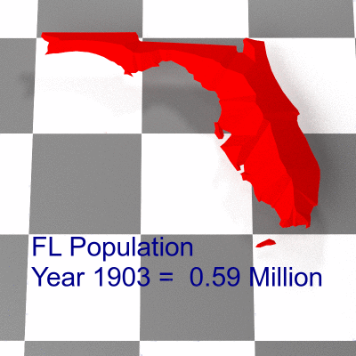

::: {.hero-home}

::: {.hero-media}
{style="width:75%; height:auto; display:block; margin:auto; border-radius:0.55rem;"}
:::

::: {.hero-content}

::: {.hero-kicker}
JUST FOR FUN
:::

# Just for Fun

::: {.hero-subtitle}
**Fun? Definitely. Useful? Debatable. 😄**
:::

A collection of mathematical experiments, animations, visualizations, and code I created mostly because I wanted to see if I could.

:::

:::

## Experiments, Animations & Other Curiosities

This section is just getting started. Over time, I’ll use this space to share mathematical experiments, animations, visualizations, code, and other things I created simply for the fun of exploring an idea.
