::: {.article-series-label}
**DSteele Article Series · DS-02**
:::

::: {.callout-note}
## Download the Technical Article

For a print-ready version with consistently formatted equations and figures:

[**Download DS-02: Mathematical Formulation of DSteele (PDF)**](DS-02_DSteele_Mathematical_Formulation.pdf){target="_blank"}
:::

## Purpose and Scope

DS-01 introduced DSteele from the perspective of its development,
motivation, implementation, and application to moving-load and Traffic
Speed Deflectometer (TSD) analysis. This companion article
documents the mathematical formulation underlying the model. The
derivation that follows is retained from my original, unpublished
DSteele formulation manuscript with only the surrounding context
reorganized for this article.

The purpose of DS-02 is not to reproduce the DSteele source code.
Rather, it is to document the mechanics and mathematical structure of
the solution: the governing equations, transformation to the wavenumber
domain, spectral-element stiffness formulation for finite layers and the
semi-infinite halfspace, treatment of elastic and viscoelastic
properties, global assembly, moving surface loading, and
inverse-transformation of the response back to the physical domain.

## Mathematical Development of DSteele

As indicated in one of my previous LinkedIn posts
([original LinkedIn post](https://lnkd.in/p/eWKApk64)), I derived the mathematical derivation of
DSteele by hand. The hand-written derivation extended across more than
twenty pages and included the displacement-potential solution,
evaluation of displacement and stress components at layer boundaries
that were ultimately used to construct the spectral-element stiffness
matrix.

Development of the formulation was iterative. Because an error
discovered late in the derivation could propagate into the layer
stiffness matrices, portions of the derivation were restarted and
checked repeatedly before being translated into code. The photographs
below preserve part of that original development record. They are
included as technical provenance for the formulation, not as a
substitute for the mathematical development that follows.

{width="6.35in"
height="4.7625in"}

*Figure 1. Original handwritten derivation developed during the
formulation of DSteele. The derivation progressed from the governing
equations and displacement potentials through finite-layer displacement
and stress relationships used to construct the spectral-element
stiffness matrices.*

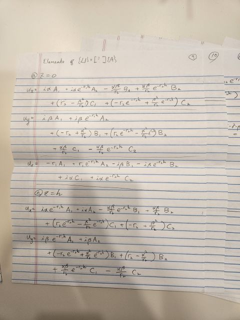{width="4.8in"
height="6.4in"}

*Figure 2. Close-up from the original handwritten development of the
finite-layer displacement relationships, including evaluation of
displacement components at the upper and lower layer boundaries prior to
their organization in matrix form.*

## Detailed DSteele Formulation

The formulation proceeds from the three-dimensional equations of motion
for an elastic, homogeneous continuum. Helmholtz decomposition is then
used to express the displacement field in terms of scalar and vector
potentials. For a load moving at constant speed, the solution is written
in a two-dimensional Fourier representation so that derivatives with
respect to space and time can be handled algebraically in the
transformed domain.

The resulting harmonic solutions are used to derive stiffness matrices
for two-noded finite-thickness layers and a one-noded semi-infinite
element. Elastic or viscoelastic layer properties are incorporated into
those element relationships, after which the individual elements are
assembled into the global pavement system. The transformed nodal
response is solved for each wavenumber pair and subsequently transformed
back to obtain the pavement response associated with the moving load.
Details of DSteele formulation is provided in the following.

## Formulation of DSteele

### Governing Equations

The formulation of DSteele starts with the classical equation of motion
for an elastic, homogeneous continuum without body forces. In terms of
the displacement vector, **u**, the equation is given as the following.

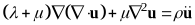
(1)

where *λ* and *μ* are the lamé constants, and *ρ* is the mass density of
the material. The stresses of an isotropic material satisfying the
governing equation shown above, are given by the generalized Hooke's law
written as the following.

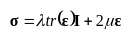
(2)

where **Ι** is the identity tensor and **ε** is the strain tensor given
as the following.

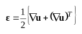
(3)

In a cartesian coordinate system such as the one shown in Figure 3,
Equation (1) represents a complicated system of partial differential
equations that need to be solved for three components of the
displacement vector (i.e., *u~x~*, *u~y~*, *u~z~*). As pointed out by
Graff (1991), Equation (1) can be decoupled into a more simpler form by
means of the Helmholtz decomposition given as the following.

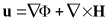
(4)

where Φ represent a scalar potential and **H** is a vector potential
whose divergence vanishes. In other words, the following condition must
hold for the vector potential **H**.

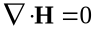
(5)

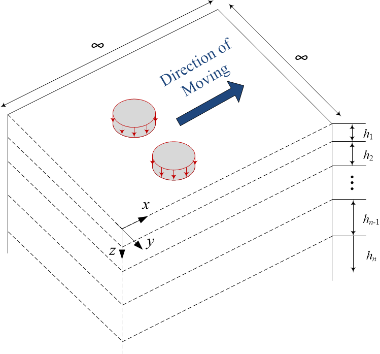{width="4.0in"
height="3.7222222222222223in"}

Figure 3. Cartesian Coordinate System with Multiple Layers on a
Halfspace

Substituting Equation (4) into Equation (1), one arrives at the
following decoupled equations for Φ and **H**.

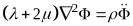
(6)

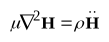
(7)

Similar to the solutions provided by Siddharthan et. al. (1998, 2000)
and Nielsen (2019), the solutions of the above equations under a load
moving at a constant speed, *V*, can be written in the form of an
inverse Fourier Transform. More specifically, the solutions for the
scalar and the vector potentials are written as the following.

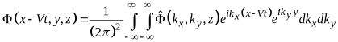
(8)

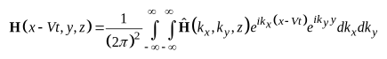
(9)

where 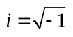{.eq-inline .eq-inline-after9-a},
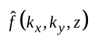{.eq-inline .eq-inline-after9-b} is the
2-dimensional (2D) Fourier transform of the function
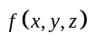{.eq-inline .eq-inline-after9-c} along the
*x* and *y* axes, and *k~x~* and *k~y~* are the wave numbers along their
respective axes.

The primary advantage of writing the solutions in the form of Equations
(8) and (9) is that the partial derivatives with respect to *x*, *y*,
and *t* reduce to simple algebraic multiplications. For example, by
denoting the Fourier transform pairs as
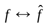{.eq-inline .eq-inline-after9-d}, it is
easily seen from Equation (8) that the partial derivative of Φ with
respect to *x*, is obtained as
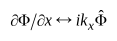{.eq-inline .eq-inline-after9-e}.
Therefore, the solution of the above equations can be obtained more
conveniently in the transformed domain (i.e., wave number or frequency
domain).

In the frequency domain, the components of the displacement vector **u**
can be written as the following in terms of the potentials.

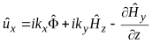
(10)

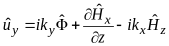
(11)

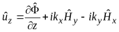
(12)

where 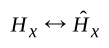{.eq-inline .eq-inline-review-large},
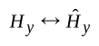{.eq-inline .eq-inline-review-large}, and
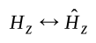{.eq-inline .eq-inline-review-large} are the
*x*, *y*, and *z* components of the vector potential **H**,
respectively.

### Solutions for Harmonic Potentials

In order to solve for the harmonic components of
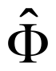{.eq-inline .eq-inline-tall} and
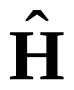{.eq-inline .eq-inline-tall} in
Equations (8) and (9), it is first necessary to transform Equations (6)
and (7) into the same wave number or frequency domain. For the scalar
potential Φ, transforming Equation (6) into the frequency domain results
in the following.

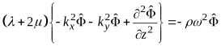
(13)

where 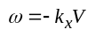{.eq-inline .eq-inline-review-large}. The
above equation can be rewritten in the form of a classical wave equation
as:

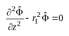
(14)

where

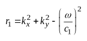
(15)

and

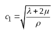
(16)

After dropping the term corresponding to the stress wave propagating in
the negative z axis, the solution for the scalar potential is obtained
as the following (Ewing et. al. 1957; Graff 1991).

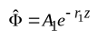
(17)

where *A*~1~ is an arbitrary constant.

Similarly, one arrives at the following wave equation for the vector
potential **H**, by following the same procedure shown above.

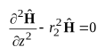
(18)

where

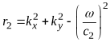
(19)

and

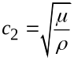
(20)

The solution for each component of **H** is obtained as the following,
after dropping the terms that result in the unbounded results.

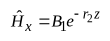
(21-1)

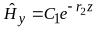
(21-2)

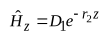
(21-3)

where *B*~1~, *C*~1~, and *D*~1~ are arbitrary constants.

### Stiffness Matrix of a Two-Noded Element with Finite Thickness

The solution for the scalar potential shown in Equation (17) and those
for the vector potential shown in Equation (21) only account for the
stress waves propagating in the positive *z*-direction (i.e., downwards,
see Figure 3). However, for a layer with finite thickness, *h*, the
stress wave not only propagates downwards, but also upwards due to the
reflection and refraction at the lower boundary. To account for the
waves propagating upwards from the lower boundary, another term is added
to the right-hand side of Equations (18) and (21) (Al-Khoury et. al.,
2001; Lee, 2013a; Lee, 2013b). Thus, the solution for the scalar
potential is written as the following.

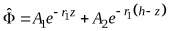
(22)

where *A*~1~ and *A*~2~ are arbitrary constants. Similarly, the solution
for the vector potential is written as:

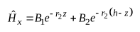
(23-1)

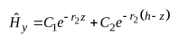
(23-2)

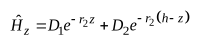
(23-3)

where *B*~j~, *C*~j~, and *D*~j~ (j = 1, 2) are arbitrary constants.
Substituting the above equation into the divergence condition of **H**,
i.e., Equation (5), one arrives at the following expression for the
arbitrary constants of
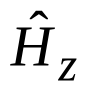{.eq-inline .eq-inline-tall}.

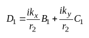
(24-1)

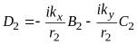
(24-2)

By substituting Equations (22) through (24) into Equations (10) through
(12), the displacements are obtained as the following.

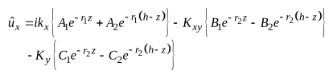
(25)

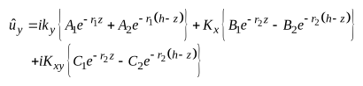
(26)

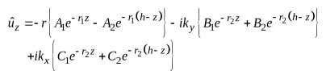
(27)

where

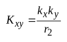
(28)

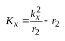
(29)

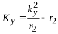
(30)

The equations for the relevant stresses are obtained by substituting
Equation (3) into Equation (2), then taking the Fourier transform with
respect to *x* and *y*. Substituting Equations (25) through (30) into
the resulting equations yields the following.

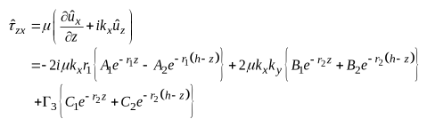
(31)

(32)

(33)

where

(34)

(35)

(36)

To construct the stiffness matrix of a layer with finite thickness, *h*,
it is necessary to obtain the displacements and the stresses at the
upper and lower boundaries. For the displacements, this is achieved
easily by substituting *z* = 0 for the upper boundary and *z* = *h* for
the lower boundary in Equations (25) through (27). The resulting
displacements are obtained as the following in matrix form.

(37)

where {.eq-inline .eq-inline-review-large} and
{.eq-inline .eq-inline-review-large}.
{.eq-inline .eq-inline-review-large},
{.eq-inline .eq-inline-review-large}, and
{.eq-inline .eq-inline-review-large} are the
displacements at the upper boundary along the *x*, *y*, and *z* axes,
respectively, and
{.eq-inline .eq-inline-review-large},
{.eq-inline .eq-inline-review-large}, and
{.eq-inline .eq-inline-review-large} are their
counterparts at the lower boundary. The matrix **S~1~** is given as:

(38)

where

(39)

(40)

Similarly, substituting *z* = 0 for the upper boundary and *z* = *h* for
the lower boundary in Equations (31) through (33) yields the following
for the stresses in matrix form.

(41)

where {.eq-inline .eq-inline-wide} in
which the subscripts 1 and 2 indicate the corresponding stresses at the
upper and lower boundaries, respectively. The matrix **S~2~** is given
as:

(42)

With the matrices **S~1~** and **S~2~** defined as the above, the
stiffness matrix of a layer with finite thickness (i.e., the stiffness
matrix of a two-noded element, with one node at the upper boundary and
the other at the lower boundary) is obtained by relating the nodal
displacements to boundary tractions. In other words, the stiffness
matrix is obtained from:

(43)

in which the stiffness matrix, **S~2-noded~**, is given as the
following.

(44)

where

(45)

### Stiffness Matrix of a One-Noded, Semi-Infinite Element

An example of the one-noded, semi-infinite element (i.e., a halfspace
element) was schematically shown as the bottom layer in Figure 3.
Obviously, the one-noded element only has a single boundary at the top
of the layer. In other words, this element does not have a lower
boundary from which the stress waves can reflect and refract back to the
upper boundary. Therefore, the stiffness matrix of a semi-infinite
element can be obtained in the same manner as the two-noded element
without the terms that govern the stress waves propagating upwards
\[i.e., *A*~2~ = *B*~2~ = *C*~2~ = *D*~2~ =0 in Equations (22) and
(23)\].

Following the same mathematical procedure previously shown for the
two-noded element, one arrives at the following for the stiffness matrix
of a one-noded element.

(46)

where the matrices **S~3~** and **S~4~** are obtained from the
displacement and stress functions as shown below.

(47)

(48)

### Incorporating Elastic and Viscoelastic Layer Properties

For an elastic material whose stiffness characteristics are
time-independent, the lamé constants can easily be obtained from the
Young's modulus, *E*, and the Poisson's ratio, *ν*. From the classical
theory of elasticity, these relationships are given as:

(49)

(50)

However, as indicated Rizzi (1989) who introduced the spectral element
solution approach for layered media, it is recommended that a small
amount of damping be added to the lamé constants, since no realistic
material is purely elastic. In classical soil dynamics, this is achieved
by adding an imaginary, hysteretic damping to the material functions
(Siddharthan et. al. 1998, 2000). In other words, the complex lamé
constants with damping are given as the following:

(51)

(52)

where *ζ* is a damping constant.

The modulus of a viscoelastic material such as Asphalt Concrete (AC) is
time (or equivalently, frequency) dependent. A well-known model for the
time-dependent viscoelastic modulus is given in terms of a sigmoidal
function of the following form.

(53)

where *E*(*t*) is the time dependent, viscoelastic relaxation modulus at
time *t*, and *c*~1~ through *c*~4~ are model constants. Similarly, the
frequency-dependent viscoelastic modulus model is often written as the
following.

(54)

where \|*E\*\|* is the dynamic modulus which is simply the amplitude of
the complex modulus *E*\* = *E*' + *iE*", *f* is the frequency, and
*d*~1~ through *d*~4~ are model constants.

Although Equation (54) may seem more natural and adequate than Equation
(53) for use with the complex stiffness matrices previously derived in
the frequency domain, one drawback of Equation (54) is that the real and
imaginary parts of the complex modulus (*E*' and *E*", respectively)
needed for these stiffness matrices cannot be obtained without the
knowledge of phase angle at different frequencies (note that Equation
(54) does not include any phase angle information). A feasible
workaround for finding *E*' and *E*" from Equation (54) is through the
Prony series representation of the complex modulus in which *E*' and
*E*" are written as the following.

(55-1)

(55-2)

where *E*~0~ and *E~i~* are the Prony coefficients, *M* is the number of
Prony elements, and *ρ~i~* is the relaxation time for the *i*^th^ Prony
element. From the above, the frequency dependent dynamic modulus can be
written as:

(56)

To determine the Prony coefficients, it is necessary to fit the dynamic
modulus expressed in the form of Equation (56) to those obtained from
Equation (54). However, due to the complicated nature of Equation (56),
this process involves a Nonlinear Least Squares (NLS) approach which
requires iteration over the objective function (which minimizes the
error between the \|*E*\*\| values from Equation (56) and those from
Equation (54)), starting from a reasonable set of seed values (i.e.,
initial guess) for the Prony coefficients (Lee, 2022).

However, the above NLS process was not desired for use with the spectral
element solution developed in this study, primarily for two reasons.
First, the \|E\*\| obtained in the form of Equation (56) depends on the
seed values, i.e., using a different set of seed values may result in
different \|E\*\| values which in turn, may result in different
responses obtained from the spectral element solution. Second, the NLS
requires iteration which increases the runtime of the implemented
algorithm, and the increase in runtime is not expected to be consistent
(as the NLS may need different number of iterations before converging,
depending on the seed values).

Due to the above challenges with determining the Prony coefficients from
\|*E*\*\|, an alternate method was adopted for implementation. Rather
than finding the Prony coefficients from the frequency-dependent
functions \[i.e., Equations (54) and (56)\], these coefficients were
determined by fitting the Prony series representation in time-domain to
the relaxation modulus represented in Equation (53). The time-domain
Prony series model for the relaxation modulus is given as the following.

(57)

Obtaining the Prony coefficients from Equation (57) is carried out by
fitting the *E*(*t*) in this equation to those obtained from Equation
(53). Due to the simple form of Equation (57), this fitting process can
be achieved through a Linear Least Squares (LLS) rather than a NLS. More
specifically, the LLS reduces to a set of linear algebraic equations
that can be written as the following in matrix form (See Lee, 2022 for a
detailed derivation and proof).

(58)

where

(59)

(60)

and *t~k~* (*k* = 0, 1, 2, ..., n) is the discrete time values at which
the value of *E*(*t*) is obtained from Equations (53) and (57) for LLS.
As seen from Equation (58), the LLS does not require any iterations
(i.e., it is solved by inverting the matrix **M** once) and does not
require nor depend on any seed values (i.e., initial guess).

Once the Prony coefficients are obtained from Equation (58), the real
and imaginary parts of the complex modulus (*E*' and *E*", respectively)
needed for the spectral element solution can easily be obtained from
Equation (55).

### Global Stiffness Matrix and Nodal Displacements

Using the element stiffness matrices derived previously, the global
stiffness matrix, **S~Global~**, is constructed in a manner similar to
the Finite Element Method (FEM) (Al-Khoury et. al., 2001; Lee, 2013a,
2013b). The global stiffness matrix is a (3∙*n*+3) by (3∙*n*+3) square
matrix (*n* = total number of layers) whose constructional schematics
are shown in Figure 4(a) for pavements with a halfspace and in Figure
4(b) for those with a shallow bedrock. In Figure 4, any region that is
overlapped by two distinct element stiffness matrices indicate the
components of the respective element matrices are summed. Additional
details regarding the global stiffness matrix construction can be found
in Al-Khoury et. al. (2001) and Lee (2013a, 2013b), and shall not be
repeated herein.

{width="4.3125in"
height="2.7916666666666665in"}

**(a)**

{width="4.864583333333333in"
height="3.1354166666666665in"}

**(b)**

Figure 4. Global Stiffness Matrix Construction for Pavement Structures
(a) with a Halfspace and (b) without a Halfspace (i.e., shallow bedrock)

Once the global stiffness matrix is constructed, the displacements at
every node of the pavement structure can be found simply by inverting
the stiffness matrix. In other words:

(61)

where

(62)

is the global displacement vector, and
{.eq-inline},
{.eq-inline}, and
{.eq-inline} are the
*x*, *y*, and *z* components of the displacement at the *i*th node,
respectively. Similarly, the global force vector
{.eq-inline .eq-inline-symbol-small} is given
as the following.

(63)

where {.eq-inline} and
{.eq-inline} are the
applied shear stresses in the z*x* and *yz* planes, respectively, and
{.eq-inline} is the
applied normal stress in the *z* direction, all of which are at the
*i*th node.

For pavements that are only subjected to the vertical load at the
pavement surface, the only non-zero component of
{.eq-inline .eq-inline-symbol-small} in
Equation (63) is the normal component
{.eq-inline}, which
can be obtained easily by taking the forward Fourier transform of the
applied pressure at the pavement surface, *p*(*x*, *y*). Mathematically,
this is written as the following.

(64)

### Time-Domain Response

Note that the global displacement vector
{.eq-inline .eq-inline-symbol-small} obtained
from Equation (61) is still in the transformed domain. As discussed
previously, the advantage of working in the transformed domain is that
the partial derivatives in the physical domain are represented as
algebraic multiplications in the transformed domain.

More specifically, because the deflection slope with respect to *x* at
the pavement surface is represented as
{.eq-inline}, its
frequency domain counterpart is simply obtained as
{.eq-inline}. Both the
deflection and deflection slope can then be brought back to the physical
domain through the respective 2D inverse Fourier transforms as shown in
the following equations.

(65)

(66)

## From Formulation to DSteele

The preceding derivation provides the mathematical foundation
implemented in DSteele. At the element level, each finite pavement layer
is represented by a stiffness matrix in the frequency domain, while the
bottom layer can be represented directly as an element of finite
thickness or a semi-infinite element. These element relationships are
assembled into the global pavement system in a manner analogous to
finite-element assembly.

For a specified moving load, the surface traction is represented in the
same transformed domain as the pavement system. Solving the global
system provides nodal displacements in the frequency domain. The inverse
transformation then returns the response back to physical domain,
allowing the model to describe the pavement response produced by a load
traveling at a prescribed constant speed.

## Response Quantities and TSD Applications

Although the formulation is developed in terms of the full
three-dimensional displacement and stress fields, DSteele was developed
with moving-deflection applications as a central motivation. Vertical
surface deflection is obtained naturally from the nodal displacements,
and the deflection slope needed for Traffic Speed Deflectometer (TSD)
analysis is also obtained easily as its derivative.

## Relationship to the DSteele Series

DS-01 provides the development history and engineering overview of
DSteele. DS-02 documents the underlying mathematical formulation. A
subsequent article will address DSteele V2 and the computational changes
used to accelerate the original implementation. Additional articles can
then treat TSD measurement and integration, direct deflection-slope
backcalculation, dimensional analysis, and the DSteele machine-learning
surrogate without repeatedly reproducing the derivation presented here.

#  REFERENCES

1.  Al-Khoury, R., Scarpas, A., Kasbergen, C., and
    Blaauwendraad, J. 2001. Spectral Element Technique for Efficient
    Parameter Identification of Layered Media. I. Forward Calculation.
    International Journal of Solids and Structures. 38: 1605-1623.

2.  Applied Research Associates (ARA). 2004. Guide for
    Mechanistic-Empirical Design of New and Rehabilitated Pavement
    Structures. NCHRP Project 1-37A, Final Report, National Cooperative
    Highway Research Program, Transportation Research Board, National
    Research Council, Washington, D.C.

3.  Ewing, W. M., Jardetzky, W. S., and Press, F. 1957. Elastic Waves in
    Layered Media. McGraw-Hill Book Company. NY.

4.  Graff, K. 1991. Wave Motion in Elastic Solids. Dover Publications,
    Inc. NY.

5.  Lee, H. S. 2013(a). Viscowave -- A New Solution for Viscoelastic
    Wave Propagation of Layered Structures Subjected to an Impact Load,
    International Journal of Pavement Engineering,
    DOI:10.1080/10298436.2013.782401.

6.  Lee, H. S., 2013(b). Development of a New Solution for Viscoelastic
    Wave Propagation of Pavement Structures and its Use in Dynamic
    Backcalculation. Ph.D. Dissertation. Michigan State University, East
    Lansing, MI.

7.  Lee, H. S. 2022. ViscoWave Documentation and User Guide.
    <https://github.com/leehyu20/ViscoWave/blob/main/ViscoWave_User_Guide_Sept%202022.pdf>.

8.  Nielsen, C.P. 2019. Visco-Elastic Back-Calculation of Traffic Speed
    Deflectometer Measurements. Transportation Research Record, Vol.
    2673, No. 12. DOI: <https://doi.org/10.1177/0361198118823500>.

9.  Siddharthan, R.V., Yao, J., and Sebaaly, P. 1998. Pavement Strain
    from Moving Dynamic 3D Load Distribution. Journal of Transportation
    Engineering, Vol. 124, No. 6. DOI:
    <https://doi.org/10.1061/(ASCE)0733-947X(1998)124:6(557)>.

10. Siddharthan, R.V., Krishnamenon, N., and Sebaaly, P. 2000.
    Finite-Layer Approach to Pavement Response Evaluation.
    Transportation Research Record, Vol. 1709, No. 1. DOI:
    <https://doi.org/10.3141/1709-06>

---

### Download DS-02

A print-ready PDF version of this technical article, with consistently formatted equations and figures, is also available:

[**Download DS-02: Mathematical Formulation of DSteele (PDF)**](DS-02_DSteele_Mathematical_Formulation.pdf){target="_blank"}

