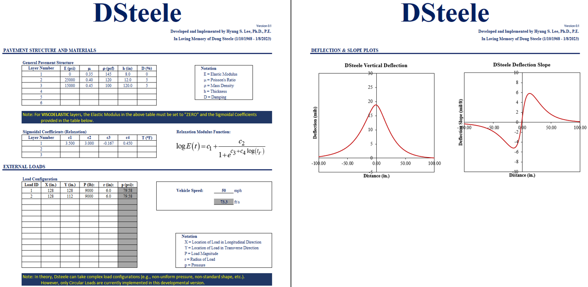
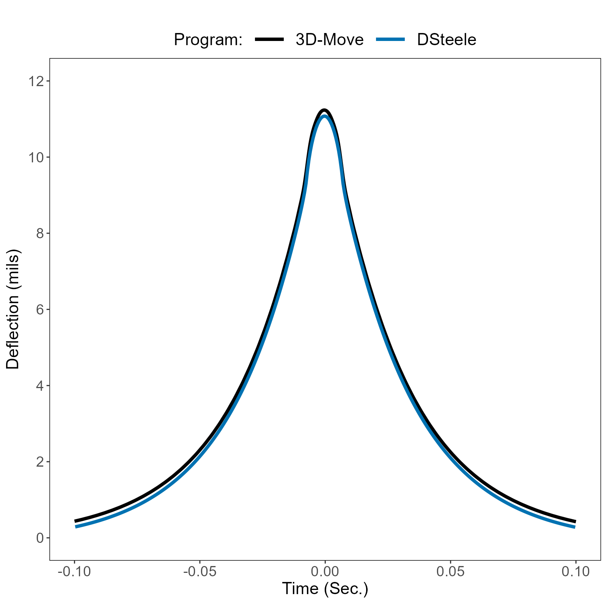

::: {.article-lead}
DSteele is a mechanics-based moving-load pavement response model developed with Traffic Speed Deflectometer (TSD) applications as a central motivation. This article introduces its origin, implementation, early evaluation, and the research questions it has enabled.
:::

## Overview

DSteele is a dynamic, three-dimensional (3D) spectral-element or finite-layer model developed to simulate flexible pavement responses under moving vehicle loads, with Traffic Speed Deflection Device (TSDD) applications as a central motivation.

The model calculates pavement response under a moving load by solving the 3D equation of motion semi-analytically in the frequency domain for each pavement layer of finite thickness. In this sense, each layer acts as a spectral element. Multiple layers (or elements) are then connected in a manner similar to the finite element method to construct the global stiffness matrix, which is solved for pavement responses including deflection. More importantly for TSD analysis, DSteele can provide deflection slope directly as a model response without approximating it numerically from a series of independently calculated deflections.

The formulation supports both elastic and viscoelastic material representations for asphalt materials. The viscoelastic material input takes the form of a time-domain relaxation modulus represented by a four-parameter sigmoidal function.

The initial DSteele implementation was developed in 2023. Its computational engine is written in C++, while an Excel-based interface is used to define pavement structures, moving loads, vehicle speed, and response output locations.

This article introduces why DSteele was developed, its implementation and early evaluation, and the research questions it subsequently enabled, many of which were discussed across my LinkedIn posts. This article is intended only as an overview. A future, separate article will document the mathematical formulation in greater depth.

## 1. Why I Developed DSteele

Traffic Speed Deflection Devices (TSDDs), which include TSDs with Doppler lasers as well as devices such as the Rolling Wheel Deflectometer (RWD) and Raptor that use distance lasers, represent a fundamentally different methodology for measuring pavement surface deflection compared with stationary impact devices such as the Falling/Heavy Weight Deflectometer (F/HWD). Rather than stopping at discrete locations and applying an impact load, a TSDD measures pavement deflection while traveling at highway speed.

For those of you who know me, you may have heard of [ViscoWave](https://github.com/leehyu20/ViscoWave). It is a dynamic, finite-layer model for analyzing F/HWD (i.e., impact-load) time-history data that I developed as part of my Ph.D. work. After I finished my Ph.D., I personally continued developing ViscoWave for moving-load or TSDD applications, but I never really had a research project that needed it.

My first exposure to a real TSDD research project came when my friend and colleague, Doug Steele (1968-2023), was leading a research effort to develop the RWD. After I finished my Ph.D. work, Doug pulled me into his RWD research team, and I had my first real occasion to use ViscoWave to simulate moving loads. Although the RWD research was completed using ViscoWave's moving-load implementation, it had one critical drawback. While it was fairly efficient for analyzing F/HWD time-history data, it was computationally inefficient—and therefore time-consuming—for simulating or analyzing moving loads.

{fig-align="center" width="45%"}

If you knew Doug, you could probably imagine him telling me that we needed something that could simulate moving loads faster and more efficiently. Yes, that is exactly what he did almost every day when he saw me in the office. I had ideas that could potentially lead to a new solution, but since our RWD research was discontinued and I became busy with other things, it never became reality.

In January 2023, we lost Doug in a tragic accident. At his funeral, I thought about what Doug had been telling me for so long: I needed to develop a new solution for moving loads. After spending countless late nights and weekends working on it, my first public description of the new solution appeared in a LinkedIn post in June 2023. I named the solution **DSteele** in honor and loving memory of my friend, Doug Steele.

## 2. What DSteele Solves

DSteele represents a layered pavement system in three dimensions. Each finite pavement layer (or element) is described by its material properties (i.e., modulus, density, Poisson's ratio, and damping) and thickness. It solves the stress-wave propagation problem for a layered pavement system under vehicle loads traveling at a constant speed. At a conceptual level, the analysis process is as follows.

1. Define the layered pavement structure and material properties.
2. Define the moving wheel-load configuration and vehicle speed.
3. Transform the variables from the physical domain, $(x,y)$, to the frequency (or wavenumber) domain, $(k_x,k_y)$, in the horizontal plane.
4. Construct the frequency-domain stiffness matrix based on the semi-analytical solution for each layer that makes up the pavement.
5. Assemble the layer stiffness matrices into a global stiffness matrix and solve for the nodal responses in the frequency domain.
6. Inverse-transform displacement and other pavement responses back to the physical (spatial) domain.

## 3. DSteele Implementation

As mentioned, the computational engine of DSteele was implemented in C++, while a developmental MS Excel interface serves as the primary user interface. This separation allows the computationally intensive spectral-element calculations to be conducted efficiently, while the spreadsheet provides a convenient way for the user to communicate inputs and outputs with the C++ engine and visualize the results without repeatedly importing or exporting files through separate software.

{fig-align="center" width="100%"}

## 4. Why Deflection Slope Matters for TSD

In this context, Traffic Speed Deflection Devices (TSDDs) include devices designed and built to measure pavement deflection from a moving platform, whereas the Traffic Speed Deflectometer (TSD) refers to a specific type of TSDD that uses Doppler laser sensors to measure pavement response.

It is important to emphasize that the Doppler lasers do not measure distance or displacement directly. Instead, they measure vertical pavement deflection velocity. For continuous pavements (e.g., flexible pavements), the deflection velocity can be divided by the vehicle velocity to yield the deflection slope, which is essentially the derivative of deflection in the longitudinal direction.

Deflection velocity, or equivalently deflection slope under the steady moving-load relationship, is a particularly unique response associated with TSDs. Other TSDDs that use distance lasers do not rely on deflection slope (or velocity) at all. To support analysis of different TSDDs that exist today as well as those that may be developed in the future, DSteele was therefore developed to calculate not only deflection but also deflection slope directly within the solution. As will be discussed in the mathematical formulation article, this quantity can be obtained naturally in the frequency domain.

## 5. Early Evaluation against 3D-Move

During early development, DSteele response was compared with 3D-Move for a common pavement/loading case. The purpose of this comparison was to check whether the independently developed moving-load solution produced a physically consistent deflection history with comparable response magnitude and shape.

{fig-align="center" width="78%"}

The curves show close agreement in overall response shape and peak deflection, with a small systematic difference visible over much of the time history. This comparison is therefore best described as an early model-to-model evaluation rather than comprehensive validation. Broader verification and validation would require a documented suite of analytical, numerical, and/or measured benchmarks.

## 6. From DSteele to DSteele V2

As the range and complexity of DSteele analyses grew, computational runtime became increasingly important. Development of DSteele V2 focused on accelerating the frequency-domain calculations without changing the fundamental physical formulation.

The idea behind V2 development was to interpolate the high-frequency portion of the frequency-response function and to take advantage of symmetry in the 2D Fourier transform. In the cases I tested during development, these changes reduced runtime by more than a factor of 20 compared with the original implementation.

This improvement was purely numerical and related to the implementation of DSteele; it did not change the underlying formulation or derivation. The details may therefore be documented in a separate article in the future.

## 7. What DSteele Has Enabled

DSteele has allowed me to explore several topics in greater depth as I studied the TSD. A short list of these topics is provided below.

- Sensitivity of modeled deflection and deflection slope.
- Investigation of assumptions used when integrating TSD slope to construct deflection.
- Separation of shifting and rotation errors in reconstructed deflection basins.
- Backcalculation using deflection slopes directly at Doppler-sensor locations.
- Evaluation of full-truck versus reduced axle/load representations.
- Comparison and correlation of TSD and FWD responses under different loading conditions.
- Dimensional analysis of moving-load pavement response.
- Development of a machine-learning surrogate for rapid prediction of DSteele response.

Some of the topics above have already been covered in bits and pieces across my LinkedIn posts. I plan to develop several of them into longer articles so that the work has a more permanent home.

## 8. DSteele in Motion

A moving-load model is easier to understand when the response is visualized in an animation. For this reason, I also developed a number of 2D and 3D visualizations of DSteele results, along with other related simulations. I plan to develop separate articles around some of the visualizations that originally appeared in my LinkedIn posts.

For this introductory article, the visualization below shows pavement deflection under a moving standard single axle, originally posted on LinkedIn.



---

### Continue the DSteele series

The next article will focus on the **detailed mathematical formulation of DSteele**, including the governing equations, transformed-domain solution, spectral-element stiffness formulation, semi-infinite halfspace, viscoelastic representation, and global assembly.
