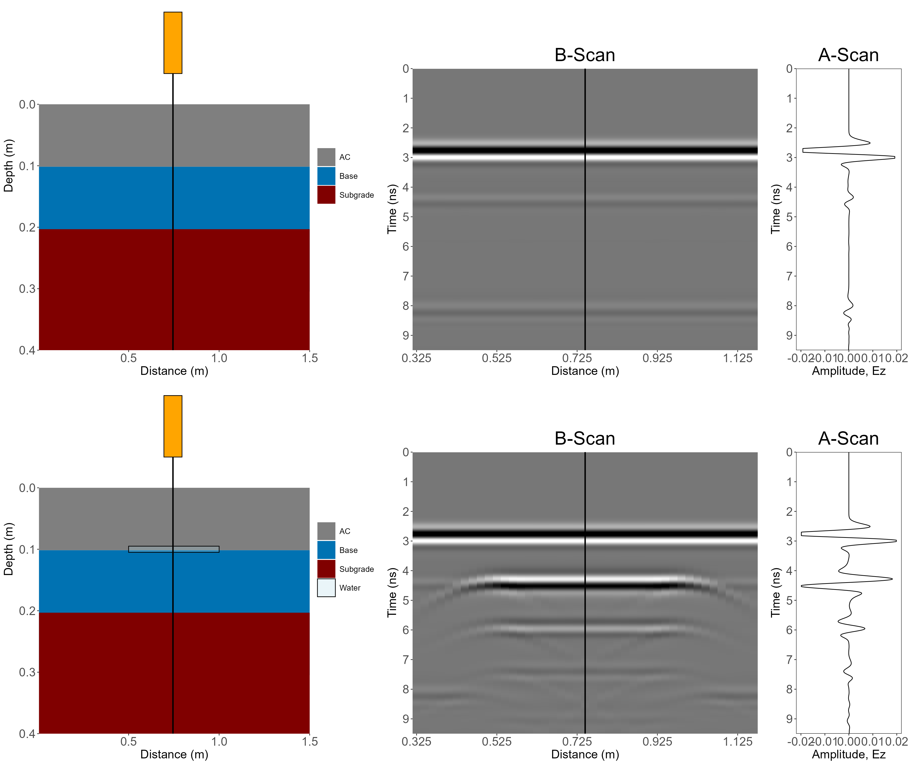
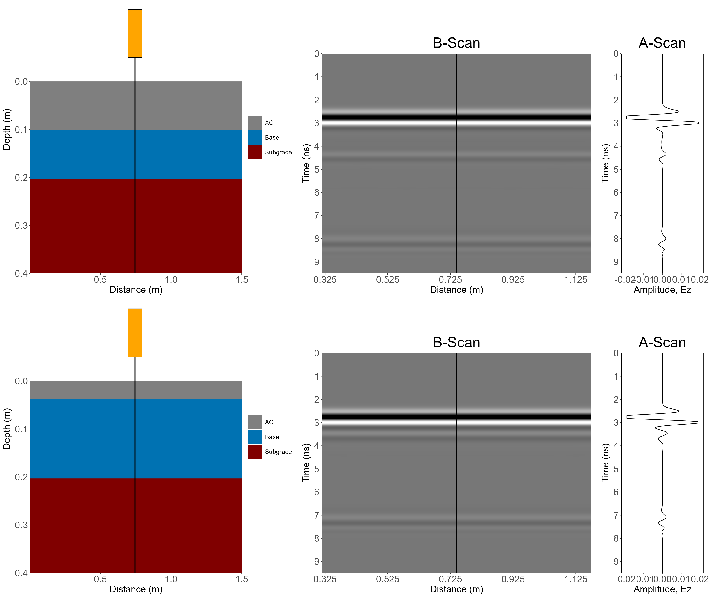
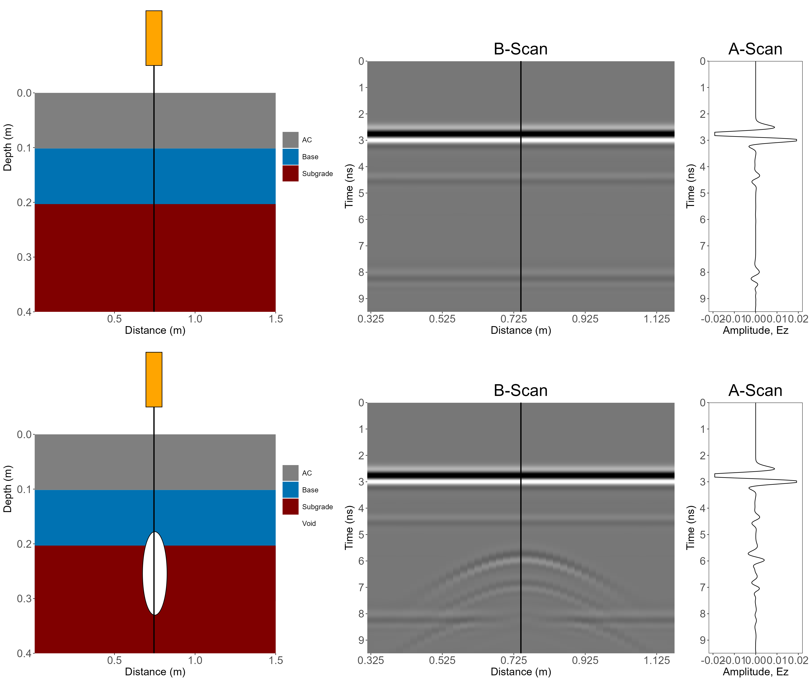

::: {.article-series-label}
**GPR Article Series · GPR-01**
:::

Hyung S. Lee, Ph.D., P.E.

This article grew out of a series of Ground Penetrating Radar (GPR) simulations that I originally shared through my LinkedIn posts. This is the first article in my GPR series (GPR-01), and it focuses on the basics: Using the Finite-Difference Time-Domain (FDTD) method for GPR simulations to understand how layer geometry, cracks, water, thin layers, and localized voids influence the simulated GPR response for relatively simple pavement structures. A follow-up article, GPR-02, will move beyond some of the simplifying assumptions I have in this article (i.e., homogeneous layers) and look into heterogeneous pavement models, including internal material structure, cracking, moisture, and compaction.

## 1. Introduction

I always thought of GPR as an attractive Nondestructive Testing (NDT) equipment because it gives us a way to investigate what is happening beneath a pavement surface without cutting, coring, or disturbing it in any other way. But that advantage also creates one of the fundamental challenges in interpreting GPR data. In the field, we do not see what is happening below the pavement surface. We only see the signal that was recorded by the GPR receiver, while the exact subsurface condition is unknown.

Again, “we only see the GPR signal, not the actual subsurface condition”. Because of this, I always wanted to approach this problem from the opposite direction. What if I create a pavement numerically, define exactly what exists below the pavement surface, transmit a virtual electromagnetic pulse through it, and examine the signal that a virtual GPR receiver records? In that environment, there is no uncertainty about the 'ground truth' because I know exactly what I created.

That is the basic idea behind the virtual GPR laboratory presented here. The objective is not to reproduce every detail of different commercial GPR systems out there. Instead, I wanted to use the Finite-Difference Time-Domain (FDTD) method developed by Yee (1966) to explore how different pavement geometries and subsurface conditions influence the electromagnetic response.

So, I started the experiments with an idealized pavement and then changed one thing at a time. As for me, this is what made the virtual GPR laboratory so fun – the idealized pavement serving as a reference and its GPR response being compared to those of other pavements with some simple subsurface anomalies.

To give you a little taste of what you are going to see in this article, Animation 1 shows how the transmitted GPR signal propagates through the idealized (or reference) pavement, gets reflected from a layer interface, and gets returned to the GPR receiver. Animation 2 shows the resulting GPR signal from this simulation. If you do not know what is meant by A-Scan and B-Scan, don’t worry about it for now. We will revisit those shortly.



::: {.text-center}
*Animation 1. GPR signal transmitted over a perfectly layered pavement.*
:::



::: {.text-center}
*Animation 2. A-Scans and B-Scans from GPR simulation of perfectly layered pavement.*
:::

In any event, now that we have the simulated GPR response from the idealized pavement, we can do a lot of fun things such as modifying the pavement geometry, introducing cracks, adding water, reducing/increasing layer thickness, or placing a localized void beneath the surface and watch how the measured response changes. How do you think these anomalies will affect the GPR response?

## 2. How This Started

Ever since the first day I used a real GPR system for assessing pavement layer thicknesses back in 2006, I always thought it would be nice to have a theoretical model that can simulate GPR response for different pavement structures. Since then, I have periodically gone back to Yee's classic FDTD formulation for GPR to see if I could implement my own FDTD method. Only 20 years later, in 2026, I finally began experimenting with an R implementation of FDTD. The initial implementation was developed with assistance from ChatGPT and then became a computational sandbox that I could study, modify, and use for different pavement structures.

After countless failures and never-ending debugging efforts, I finally arrived at the first useful version which included a Perfectly Matched Layer (PML) boundary and an approximately 1.5-GHz GPR source. My first test was intentionally kept to a very simple pavement structure: a flexible pavement with 4.0 in. Asphalt Concrete (AC) layer and an 8.0 in. base layer over subgrade.  Once I could physically recognize the transmitted and reflected signals, the model became much more interesting, not because the first successful simulation was fairly realistic, but because it gave me a baseline from which I could change one thing at a time.

The numerical implementation itself is not the focus of this article, so I will not reproduce the R code here. Instead, I will describe the model, some of the simple changes I made to the pavement structure, and what those changes did to the simulated GPR response.

Also just to make sure I say this. If you are a Python user, you might be able to do something similar to what I am doing here with [gprMax](https://gprmax.org/). However, I have never been a Python user (at least to this date), so I do not have any experience with it. But if you do, why don’t you give something like this a try?

## 3. What the Virtual Experiment Is Doing

At its core, the FDTD model discretizes the spatial domain (including the different layers of the pavement as well as the layer of air above it where the GPR antenna would be located within) into a Two-Dimensional (2D) grid and advances the electromagnetic field over time. Each pavement region and the layer of air are represented by some electromagnetic properties that are typical for the respective materials, and the GPR source transmits a short pulse above the pavement surface. As the GPR pulse propagates and encounters boundaries between materials with different electromagnetic properties, part of the energy continues propagating downward while the remaining part is reflected back to the GPR receiver (or sensor).

Obviously, the GPR sensors (i.e., transmitter and receiver) are located within the layer of air above the pavement. For a given antenna position, the receiver records the reflected GPR signal amplitude as a function of time. The reflected GPR amplitude (at a given antenna location) recorded by the receiver and plotted as a function of time, is called the A-scan. As you move the GPR antenna, it will repeat this process and you will end up with a series of A-scans along the distance traveled by the antenna. Stacking these A-scans side-by-side (and frequently shown as a 2D color-coded image where the x-axis is the distance traveled by the GPR antenna, y-axis is time as was in the A-scan, and the color represents the returned amplitude) gives us the B-scan representation that you may be familiar with. That is what I showed in Animation 2 earlier for the idealized or reference pavement.

The numerical model used for these experiments is a 2D FDTD model with Convolutional Perfectly Matched Layer (CPML) boundaries on all four sides. The antenna is represented as a finite-width transmitter and receiver rather than a point source. It is intended to approximate the behavior of a 1.5-GHz ground-coupled GPR antenna, not to reproduce the proprietary internal design or exact emitted waveform of a commercial GPR antenna. For those of you that may wonder, Table 1 summarizes some of the important parameters I used throughout the simulations.

**Table 1. Parameters used in the 2D FDTD GPR simulation.**

| Category | Parameter | Value / Configuration |
| --- | --- | --- |
| Numerical grid | Grid spacing | dx = dz = 0.005 m (5 mm) |
| Numerical grid | Grid size | 300 x 280 cells (approximately 1.50 m x 1.40 m) |
| Antenna approximation | Nominal center frequency | 1.5 GHz |
| Antenna approximation | Effective Tx/Rx position | Transmitter (Tx) and receiver (Rx) at 30 mm above pavement |
| Antenna approximation | Tx-Rx horizontal offset | 0.060 m (6 cm) |
| Material properties | Air | Dielectric constant = 1.0; Electrical conductivity = 0 S/m |
|  | Water | Dielectric constant = 80.0; Electrical conductivity = 0.03 S/m |
|  | Asphalt concrete | Dielectric constant = 5.0; Electrical conductivity = 0.001 S/m |
|  | Granular base | Dielectric constant = 7.0; Electrical conductivity = 0.003 S/m |
|  | Subgrade | Dielectric constant = 12.0; Electrical conductivity = 0.010 S/m |
| B-scan acquisition | Scan interval | 0.020 m (2 cm) |

## 4. Experiment #1 —The Reference or the Boring Pavement Structure

The best place to begin is the “least realistic”, or the idealized pavement I already showed you in Animations 1 and 2. Again, this pavement has a 4.0 in. AC and an 8.0 in. base over subgrade. Because it is an idealized pavement, the layer interfaces are perfectly flat and the material properties (i.e., dielectric constant and electrical conductivity) are known without any uncertainty or variability. For this pavement, the GPR wavefront reaches the layer boundary in a “smooth” manner and the reflected energy returns in a relatively organized manner.

The simple and unrealistic geometry of this pavement may not be all that meaningful and you may think that the simulation results look “boring” at best. But it does show how the GPR signal propagates and reflects under an idealized scenario where there are no anomalies whatsoever. We can watch the transmitted pulse leave the antenna, interact with the pavement surface, continue through the AC, encounter the AC/base interface, and then interact with the deeper base/subgrade interface. The corresponding A-scan provides the receiver's view of those events.

In summary, the results from this simulation (Animations 1 and 2) showed us two important things: (1) how the electromagnetic field is physically propagating and reflecting inside the modeled pavement and (2) what the GPR receiver ultimately sees and records. That baseline is valuable because we want to understand how this may change once we start introducing some anomalies into the pavement structure.

## 5. Experiment #2 — Real Pavements Are Not Perfectly Flat

The baseline pavement is useful, but it is also boring. Real pavement layers do not have a perfectly uniform thickness along a roadway. To see how this could affect the GPR response, I decided to introduce a little variability into both the AC and base thicknesses.

So for Experiment #2, I varied the AC and base thicknesses using a normal probability distribution. The AC thickness was varied with a mean of 4.0 in. and a standard deviation of 0.4 in. while the base thickness was varied with a mean of 8 in. and a standard deviation of 0.75 in. See animations 3 and 4 for the results.



::: {.text-center}
*Animation 3. Propagation of GPR signal through the reference pavement and a pavement with nonuniform thickness ([Animation_3_LinkedIn_Post](https://lnkd.in/p/eynNY26m)).*
:::



::: {.text-center}
*Animation 4. A-Scans and B-Scans from the reference pavement and a pavement with nonuniform thickness ([Animation_4_LinkedIn_Post](https://lnkd.in/p/e-USMMXF)).*
:::

The difference is immediately visible, right? In the uniform pavement, the AC/base and base/subgrade interfaces were comparatively easy to identify. Once the interfaces became nonuniform, those reflections became less clean.

Why? The GPR wave no longer encounters a perfectly flat interface. Instead of reflecting the energy back to the receiver in one orderly pattern, the irregular interface redirects the energy in many different directions. Consequently, the irregular interface caused increased scattering of the GPR signal, potentially reducing the reflected energy received by the antenna.

This is an important reminder when interpreting real GPR data. A weak or messy interface does not necessarily mean the interface is absent. The geometry of the interface itself can change how much reflected energy makes it back to the antenna.

Also, just in case you wonder why the pavement layers are colored differently in Animations 2 and 4. Animation 2 was created as I was preparing this article, not when I was working on my LinkedIn posts. So, Animation 2 has a more “recent” color scheme that I prefer to use. But for the contents coming from my LinkedIn posts, I will use the same color scheme I used there.

## 6. Experiment #3 — What Do Closely Spaced Bottom-Up Cracks Do?

In Experiment #3, I wanted to introduce an intentionally exaggerated “fatigue” crack pattern. The purpose was not to claim that this geometry represents a real cracked pavement. It was a controlled numerical experiment that I designed to make the interaction between the wave and the crack tips easy to observe.

I started with the reference pavement and inserted the bottom-up cracks throughout the AC layer. Each of the modeled bottom-up cracks were 1.0 cm wide, began at the bottom of the AC layer, terminated at mid-depth, and were spaced every 2.0 cm. See the animation below for how the GPR signal propagates through this pavement.



::: {.text-center}
*Animation 5. Propagation of GPR signal through the reference pavement and a pavement with idealized bottom-up cracks ([Animation_5_LinkedIn_Post](https://lnkd.in/p/etWPTsdZ)).*
:::

Compared with the intact pavement, the cracked model produced additional scattering and a noticeably distorted receiver response. The interesting behavior occurred at the crack tips. Because there are so many crack tips at the same depth and were closely spaced, their individual responses began to overlap. Collectively, they almost looked like an additional or 'artificial' interface even though no continuous material boundary existed at that depth.

Figure 1 shows the A-scans and the B-scans from both pavements (Sorry, I did not necessarily create animations for all B-scans, but I hope the figure tells the story just as well). The same concept helps explain why a localized feature and a distributed feature can look very different in a B-scan. A single crack tip may generate a localized hyperbolic-type response (if the crack tip was wide enough for the GPR signal), while many closely spaced responses can overlap and begin to look more like a continuous reflector.

{fig-align="center" width="100%"}

## 7. Experiment #4 — Put Water at the AC/Base Interface

As you may already know, the dielectric constant of water is much higher than any other materials. Thus, water almost always affects the GPR signal propagation and reflection dramatically because it creates a strong electromagnetic contrast. To visually see that effect, I started with the reference pavement again and modeled a thin layer of water (5.0 mm or approximately 1/5-in.) trapped at the AC/base interface over a horizontal distance from approximately 0.5 m to 1.0 m.

This is not intended to be a realistic representation of how moisture exists in a real pavement by any means. A real “wet pavement” would likely involve changes in moisture content within the unbound layers, and therefore electromagnetic properties. I will get into a little bit of that in the next GPR article but here, the thin water layer was used simply to make the effect easier to see. The results are shown below in Animation 6 and Figure 2.



::: {.text-center}
*Animation 6. Propagation of GPR signal through the reference pavement and a pavement with a thin layer of water at the AC/base interface ([Animation_6_LinkedIn_Post](https://lnkd.in/p/e4NXJXY9)).*
:::

{fig-align="center" width="100%"}

The first thing I want to point out is the strong reflection from water. In the simulated A-scan and B-scan, the response associated with the bottom of the AC appeared at roughly 4.5 ns in both pavements, but the amplitude of the GPR signal reflected from water was nearly comparable to the direct coupling between transmitter and receiver.

The second thing is that because so much energy was reflected from the water-bearing interface, the GPR signal kept “bouncing” between the pavement surface and the water layer. This bouncing of GPR signal resulted in additional peaks that appeared at approximately 6.0 ns and 7.5 ns in the A-scan and B-scan. Those later peaks are NOT additional pavement interfaces. They were repeated reflections or “ringing” of the GPR signal traveling back and forth between the water and the pavement surface (i.e., the GPR energy is “trapped” between the water and the pavement surface).

And because most of the GPR energy is trapped above the water, there is not enough GPR energy left to propagate down to the base/subgrade interface. This is why it is very difficult (or close to impossible) to see the base/subgrade interface in the A-scan and B-scan results. This is exactly the kind of situation where simply counting peaks in an A-scan could lead to a misleading interpretation.

## 8. Experiment #5 — What If the Asphalt Layer Is Too Thin?

For Experiment #5, I wanted to ask a more practical question. What happens when the layer we want to identify is thin enough such that GPR reflections from its top and bottom interfaces occur very close together in time?

This one was fairly easy for me. Starting with the reference pavement which had 4.0 in. of AC, I simply changed the thickness to 1.5 in. Animation 7 and Figure 3 show the results from this experiment.



::: {.text-center}
*Animation 7. Propagation of GPR signal through the reference pavement and a pavement with a thin AC ([Animation_7_LinkedIn_Post](https://lnkd.in/p/evepbqBU)).*
:::

{fig-align="center" width="100%"}

For the reference pavement with 4.0 in. of AC, the GPR signal reflected from the bottom of AC is clearly visible at approximately 4.5 ns. However, for the pavement with 1.5 in. AC, the corresponding GPR signal occurred at approximately 3.5 ns and began to overlap with the much stronger signal from the pavement surface.

The important thing is not simply about a thin layer producing a shorter travel time for the GPR signal. It is resolution or the interaction between the GPR antenna frequency and the thickness of the layer. If there  is a layer that is fairly thin for the given antenna frequency, the two interfaces – at the top and at the bottom of this thin layer – can produce responses that are blended together. This is why the GPR signal from the bottom of the thin AC layer may look like it is part of the surface reflection rather than a separate layer boundary.

I personally thought that this experiment also provided a need for further signal-processing approaches for decomposing the blended GPR signal when there is a thin layer. I have not tried it myself, but for anyone interested, Chen et al. (2026) provides a methodology that you could use for decomposing the blended GPR signal due to thin layers.

## 9. Experiment #6 — Why Does a Void Make a Hyperbola?

One of the most well-known features of a GPR B-scan is the hyperbola – or often casually called parabola – which is the “signature” of GPR associated with many localized subsurface objects. Pipes, reinforcing bars, and voids are classic examples.

If you ask Google, it may tell you that the signature hyperbola is because the GPR sends the signal in a “cone-shaped” manner and picks up the reflected signal before and after the antenna passes over the anomaly. Well… for Experiment #6, I wanted to see that visually.

So, again starting with the reference pavement, I inserted a circular void with a diameter of 6.0 in. at a center depth of approximately 10 in. below the pavement surface.

See Animation 8 for how the GPR signal propagates and reflects back to the antenna. Note that I did something different here. Rather than including the reference pavement again, I included the 4 different locations for the GPR antenna relative to the void, so that I can show what happens as the antenna approached, passed over, and moved away from the void.

Figure 4 shows the resulting hyperbola in the corresponding B-scan (Note: due to the different scales used for the x and  y axes in this graph, the void looks more or less like an oval rather than a circle).



::: {.text-center}
*Animation 8. Propagation of GPR signal through a pavement with a void ([Animation_8_LinkedIn_Post](https://lnkd.in/p/e574ejKT)).*
:::

{fig-align="center" width="100%"}

Do you agree with Google that the “GPR sends the signal in a cone-shaped manner”? In my opinion, this is probably a very simplified version of what it truly is. But you know what? In the Falling Weight Deflectometer (FWD) world, we love to talk about the “Influence zone” to explain why the deflections further away from the loading plate is representative of the subgrade response. Do you see the similarity here?

In any event, what we see here is that the GPR antenna does not need to be directly above the void before the energy can interact with it. As the antenna moves, the propagation path to the localized target changes. The arrival time therefore changes from one A-scan to another, depending on the location of the antenna. Of course, if the antenna is closer to the target, that means less time for the GPR signal to travel back to the antenna. Stack those A-scans side-by-side and you get the signature hyperbola in your B-scan.

## 10. What Did These Simple Experiments Tell Me?

I emphasize again that the experiments from this virtual GPR laboratory are NOT intended to reproduce an actual field GPR survey. I hope the value comes from doing the opposite – simplifying the problem enough that the cause of a particular response can be isolated for us to understand. So, here is a quick summary of what we saw in this article.

- A perfectly flat layer interface produces very clean, recognizable GPR results. However, the geometry of the interface itself may affect the scattering of the GPR signal and change how much energy is reflected back to the antenna.
- Closely spaced discontinuities can produce overlapping responses that may look like an artificial layer in the GPR scans.
- A strong dielectric contrast such as water can dominate the response, create repeated reflections (i.e., ringing), and may not show you the layer interfaces below the water.
- Thin layers may be a little more challenging to identify because the GPR signals reflected from the top and bottom interfaces of the thin layer may start to overlap.
- Hyperbolic responses in GPR B-scans arise from changes in travel time as the antenna moves relative to a localized target.

## 11. Where This Goes Next — GPR-02

There is also an obvious limitation to all experiments I showed here. The pavement layers are still treated largely as homogeneous materials. Real asphalt concrete is not a uniform block. It contains aggregate, asphalt mastic, and air voids. Unbound base and subgrade layers are heterogeneous as well. Once that internal structure is represented explicitly, the electromagnetic field has many more boundaries and contrasts to interact with.

That is where my next GPR article (GPR-02) will begin. Instead of asking how GPR responds to idealized layers and isolated anomalies, the next article will move toward a heterogeneous virtual pavement and examine how material structure, cracking, moisture, and compaction influence the simulated response.

The basic question remains the same. If we know exactly what is inside the pavement, what will the GPR data actually look like?

So, GPR-01 is intentionally the fundamentals article. GPR-02 will pick up from here by replacing the largely homogeneous layers used above with heterogeneous pavement materials and asking a harder question: can we still identify and interpret the response when the pavement itself is generating substantial internal reflections and scattering?

Here is a little preview of the pavement cross-section that we will see in GPR-02. Stay tuned!



::: {.text-center}
*Animation 9. Heterogeneous pavement model showing crack propagation and water intrusion ([Animation_9_LinkedIn_Post](https://lnkd.in/p/eRNis3Zx)).*
:::

## 12. References

Chen, Y., Abufares, L., and Al-Qadi, I.L. Reliability of In-Situ Asphalt Concrete Density Prediction by Roller-Mounted GPR. NDT & E International. Vol. 161. Article 103708. June, 2026. DOI: https://doi.org/10.1016/j.ndteint.2026.103708.

Yee, K.S. Numerical Solution of Initial Boundary Value Problems Involving Maxwell’s Equations in Isotropic Media. IEEE Transactions on Antennas and Propagation. Vol. AP-14, No. 3. pp. 302-307. May, 1966.

