::: {.article-series-label}
**TSD Article Series · TSD-01**
:::

This article is based on the presentation I gave at the 2026 FWD User
Group (FWDUG). The FWDUG presentation can be downloaded from my
ResearchGate site:
[FWDUG_Presentation](https://www.researchgate.net/publication/414436425_Four_4_TSD_Myths_Confirmed_Busted_or_Plausible).

One distinction I need to make before we jump into the article. In this
article, a Traffic Speed Deflection Device (TSDD) is defined as any
equipment designed and built to measure pavement deflection at high
speeds, regardless of the technology used. Traffic Speed Deflectometer
(TSD), on the other hand, is one type of TSDD that specifically uses
doppler lasers for measuring pavement surface velocity (or deflection
velocity). So, TSDDs include TSD, Rolling Wheel Deflectometer (RWD),
Raptor, etc. That extra "D" matters!

## 1. Introduction

Over the past decade or so, I have spent considerable time working with
Traffic Speed Deflectometer (TSD) theory and data, developing
computational tools for simulating pavement response under moving loads,
and asking questions about assumptions that are commonly made when
interpreting TSD data.

These are also some of the questions I received most frequently from my
colleagues. While some of them understood what I was verbally telling
them, some others struggled to follow my verbal explanation without any
visual proof in front of them. So, I decided to call these questions
(that I receive the most regarding TSDs) the 4 myths and wanted to
explain them with some of the theoretical proofs that I generated over
the past year or so.

Several of these questions have appeared in bits and pieces throughout
my LinkedIn posts, and I will provide the links to those posts where
applicable. Here are the 4 myths and I will provide you my current
conclusions on whether they are Confirmed, Busted, or Plausible in the
remainder of this article. These questions may initially seem
independent, but they are not. The answer to one myth also helps set up
the next.

  -----------------------------------------------------------------------
  TSD Myths 
  --------- -------------------------------------------------------------
  Myth #1   Pavement deflection under moving load (e.g., TSDD) has good
            correlation with deflection under impact load (e.g., FWD).

  Myth #2   TSD deflection slopes can be integrated to provide
            deflections.

  Myth #3   You MUST consider all TSDD axles (or tires) in your model.

  Myth #4   TSD deflection slopes can be used for backcalculating layer
            moduli, including subgrade modulus.
  -----------------------------------------------------------------------

{width="3.4840562117235345in"
height="3.4840562117235345in"}

Note that there is a PowerPoint file that I used to present this
material at the 35^th^ Falling Weight Deflectometer User Group (FWDUG)
meeting that was held in September, 2026. This article will closely
follow the material that I had in that presentation. The original
presentation, including the complete slide deck and animations, is
available on my ResearchGate website.

[**📊 View / Download Original Presentation on ResearchGate ↗**](https://www.researchgate.net/publication/414436425_Four_4_TSD_Myths_Confirmed_Busted_or_Plausible){target="_blank"}

## 2. Scope and Definitions

The analyses presented here are limited to continuous pavement systems,
specifically flexible pavements. Joints and other pavement
discontinuities are not considered. My conclusions will be 100% based on
theoretical simulations, i.e., no field data was used in the analyses
presented in this article.

For TSDs equipped with doppler lasers, the deflection slope is defined
as deflection velocity (measured by the doppler lasers) divided by
vehicle speed:

$$
S(x) = \frac{V_{def}}{V_{v}}
$$ {#eq-slope-velocity}

where *S* is deflection slope, *V*~def~ is the measured deflection
velocity and *V~v~* is vehicle speed.

It is emphasized that the relationship in @eq-slope-velocity only holds for
"Continuous Pavements". For pavements with joints or any other
discontinuities, this relationship doesn't necessarily hold true and I
will try to develop another article on this subject in the future. But
for this article, we are only interested in continuous pavements that
@eq-slope-velocity can be used for calculating the deflection slope.

::: {.callout-note .myth-verdict appearance="simple" icon=false}

**One Distinction That Must Be Made Clear**

[**Is the deflection slope a "measured" parameter from TSD?**]{.darkred} I would say [**YES**]{.darkred}. This is because there is no uncertainty in calculating the deflection slope from the deflection and vehicle velocities. In other words, if you and I start with the same deflection and vehicle velocities, we both will arrive at the same deflection slope.

[**What about deflection itself from the TSD? Is this a measured parameter?**]{.darkred} This is clearly [**NO**]{.darkred}. Going from deflection slope to deflection requires some sort of integration. However, depending on the assumptions you make, you may end up with completely different deflections from the same deflection slope. For this reason, [**deflection from TSD is an analyzed parameter, NOT a measured parameter**]{.darkred}. A little more discussion on this topic is provided under Myth #2 and I might even develop another article on this specific topic.

:::

## 3. Myth #1 --- Pavement deflection under moving load (e.g., TSDD) has good correlation with those under impact load (e.g., FWD)

At first glance, this may sound reasonable. Both the Falling Weight
Deflectometer (FWD) and Traffic Speed Deflection Devices (TSDDs) apply a
known load to a pavement surface and measure the resulting deflection.
If both devices are evaluating pavement structural condition, it is
tempting to expect the measured deflections to correlate well.

Mechanically, however, TSDDs (i.e., moving loads) and FWDs (i.e., impact
loads) are totally different. According to a paper that my friend, Doug
Steele (1968-2023) and I co-authored, some of the differences in loading
characteristics include the following (Steele et al., 2021).

-   Loading mode: impact versus moving load

-   Loading rate: speed effects

-   Load configuration: single plate versus dual tires

-   Half-axle versus full-axle configurations

-   Constant target loads versus dynamic variations

For the above-referenced study, Doug had asked me to make a lot of
ViscoWave runs for both the FWD and the Rolling Wheel Deflectometer
(RWD) -- A TSDD that we were developing at the time. The pavement
structures we simulated at the time, are shown in Table 1.

**Table 1. Pavement layer properties studied in the previous study by
Steele et al. (2021).**

  ------------------------------------------------------------------------
  **Layer**        **Thickness       **Modulus (ksi)** **Temperature
                   (in)**                              (˚F)**
  ---------------- ----------------- ----------------- -------------------
  Asphalt Concrete 4, 8, 12, and 16  Sigmoidal Fcn     50, 70, and 90

  Base             8, 10, and 12     40, 60, and 80    N.A.

  Subgrade         120               10, 20, and 30    N.A.
  ------------------------------------------------------------------------

To provide some sample results we got from the above study, Figure 1 and
Figure 2 show the pavement deflections differ under different loading
modes and different loading configurations, respectively. Yes, the
deflections are different, but they are not that different. So, were
there any correlations between the FWD and RWD deflections?

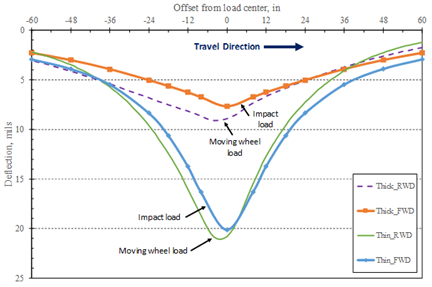{width="90%"
}

**Figure 1. Effect of loading mode on pavement deflection (Steele et
al., 2021).**

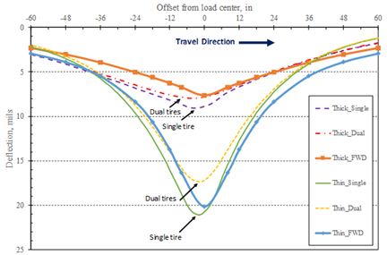{width="90%"
}

**Figure 2. Effect of loading configuration on pavement deflection
(Steele et al., 2021).**

Figure 3 shows the correlation between the maximum deflections obtained
under the FWD (9-kip peak load) and the RWD (18-kip single axle with
dual tires, i.e., total of 4 tires traveling at 60 mph). Well... Not
bad, right? The figure clearly shows a decent correlation with an
impressive R^2^ value of 0.85! But is this the end of the story? It is
not. Let's revisit this in this myth.

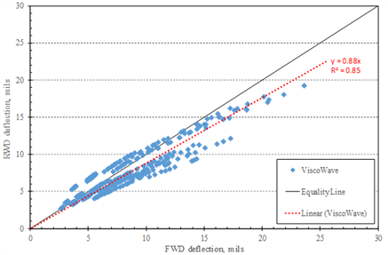{width="90%"
}

**Figure 3. Comparison of maximum FWD and RWD deflections (Steele et
al., 2021).**

### 3.1 Revisiting the comparison

Looking back at Table 1, you may think Doug and I had covered a pretty
broad range of pavement structures. The Asphalt Concrete (AC) thickness
ranged from 4.0 to 16.0 in. and the base thickness ranged from 8.0 to
12.0 in. What about subgrade? Table 1 shows that the subgrade thickness
was fixed at 120.0 in. This means that there was a stiff bedrock at
132.0 to 148.0 in. below the pavement surface depending on the AC and
base thicknesses. Is this subgrade thickness of 120.0 in. adequate for
all pavements we see in the field? My experience says NO, and this is
what we are about to revisit.

For the myths to be presented in this article, I generated 1,770
pavement structures for simulation. Table 2 shows the thickness and
modulus of the pavement layers. Note that I intentionally fixed the AC
and base thicknesses so that I can highlight the influence of subgrade.

**Table 2. Pavement layer properties used for the TSD myths in this
article.**

  -----------------------------------------------------------------------
  **Layer**               **Thickness (in.)**     **Modulus (ksi)**
  ----------------------- ----------------------- -----------------------
  Asphalt Concrete        8 (fixed)               100--500

  Base                    10 (fixed)              10--100

  Subgrade                100--300                2--18
  -----------------------------------------------------------------------

For Myth #1, the FWD responses (i.e., deflection time histories) were
obtained from ViscoWave (<https://github.com/leehyu20/ViscoWave>) by
simulating an impact load of 9-kip peak load with a duration of 25-ms
applied on a 12-in diameter loading plate. The moving-load responses
were obtained from DSteele by simulating an 18-kip single axle with dual
tires (i.e., 4 tires total with 4.5-kip load on each tire).

Here is an animation I generated to show the TSDD deflections and the
FWD time histories for all 1,770 pavements.



**Animation 1. TSDD Deflection vs. FWD Time History
([Animation 1 LinkedIn Post](https://lnkd.in/p/em2JpqK9)).**

From the above results, I extracted the deflections at several different
offsets (0, 8, 12, 18, 24, 36, 48, 60, and 72 in.) from the center of
the FWD load plate as well as from the center of two dual tires of TSDD.
Here is the animation that shows how these deflections at different
offsets compare. Watch carefully when the subgrade thickness and/or
modulus changes.



**Animation 2. 1:1 Comparison of FWD and TSDD deflections
([Animation_2_LinkedIn_Post](https://lnkd.in/p/epW8FJDu)).**

Did you see what happened? Here is a summary of what I saw. When AC or
base modulus changes for a given subgrade condition (i.e., thickness and
modulus), the FWD-vs-TSDD relationship generally moves in a relatively
consistent direction as indicated in Figure 4. For example, all the
points move around the red curve for a given subgrade condition but the
points will move around the green curve for a different subgrade
condition.

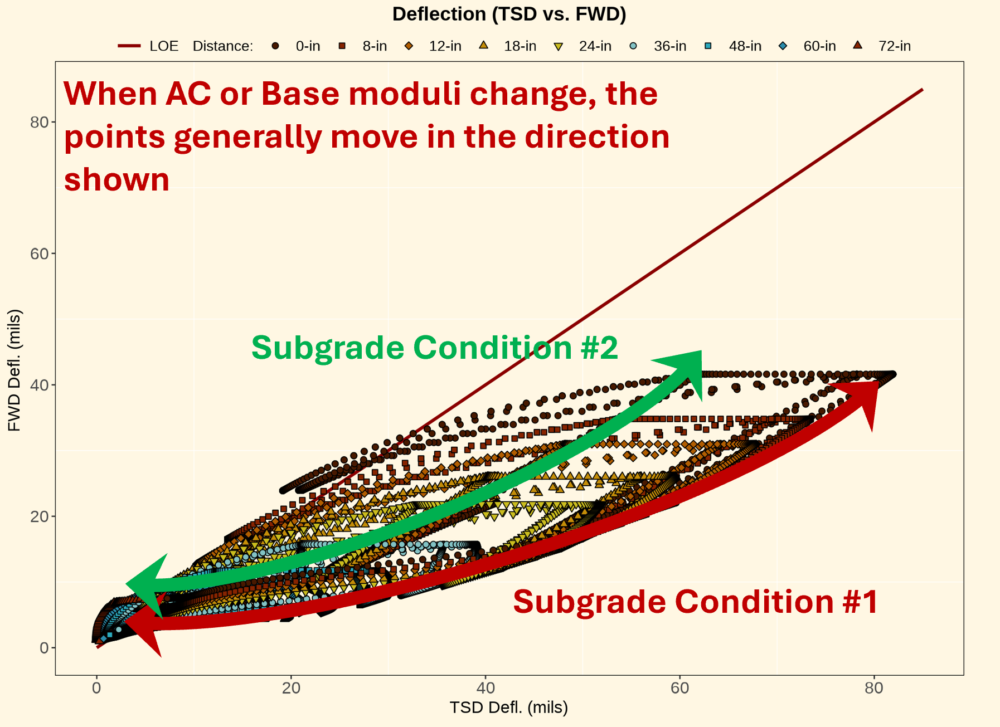{width="90%"
}

**Figure 4. All 1,770 FWD-vs-TSDD deflection comparisons. What happens
when AC and/or base modulus changes for a given subgrade condition.**

What does that mean? It means that you might be able to establish a
decent correlation for a given subgrade condition. However, when the
exact same pavement (i.e., same thickness & modulus for both AC & base)
is sitting on a different subgrade, you will get a completely different
correlation. In other words, when subgrade modulus or thickness changes,
the entire FWD-vs-TSDD deflection relationship will shift left or right
as indicated in Figure 5.

So, how would you develop a correlation between FWD and TSDD deflections
for a variety of pavements? Remember, the AC and base thicknesses were
never varied in this simulation. So, imagine what is going to happen
once you start varying AC, base, and subgrade thicknesses altogether.
The correlation will likely look much worse than what you see in Figure
4 or 5.

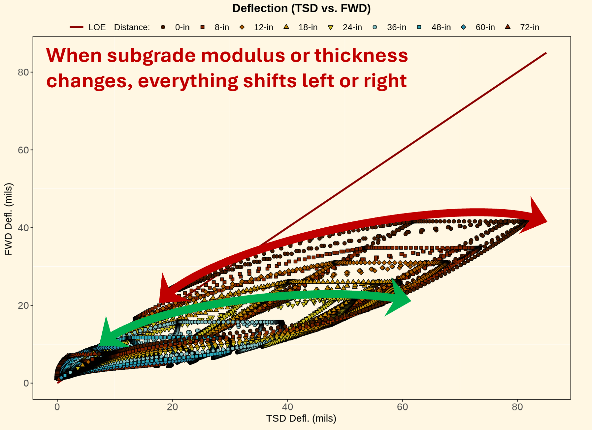{width="90%"
}

**Figure 5. All 1,770 FWD-vs-TSDD deflection comparisons. What happens
when subgrade thickness or modulus changes.**

### 3.2 Why does the subgrade change the entire relationship or correlation?

The keyword here is "INTERACTION". Under moving
dual-tire/full-axle/full-truck configurations, stress and response
fields from multiple tires start interacting (or overlapping if you
prefer this terminology) within the pavement system.

Consider the dual tires of a half-axle shown in Figure 6. Each tire
would have its own influence zone (note that this influence zone is
over-simplified here as it is only intended to illustrate the concept).
But because the duals are quite close to one another, the influence
zones from the 2 tires start overlapping within the AC layer. The
consequence is shown in Figure 7 where the deflection is plotted along
the transverse direction. See the "w" shape deflection below the tires?
That shape is due to the interaction.

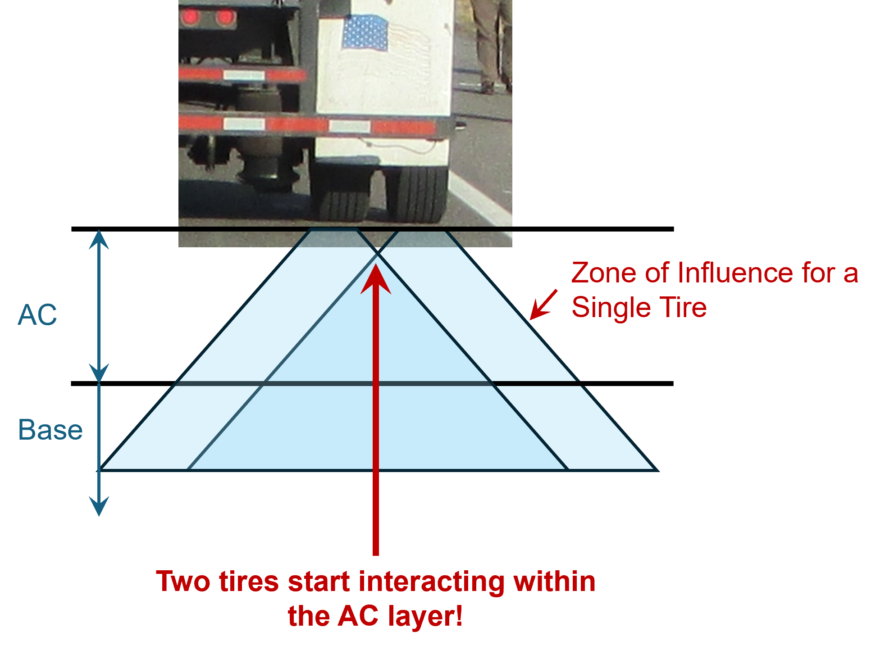{width="90%"
}

**Figure 6. Interaction of dual tires due to influence zone
overlapping.**

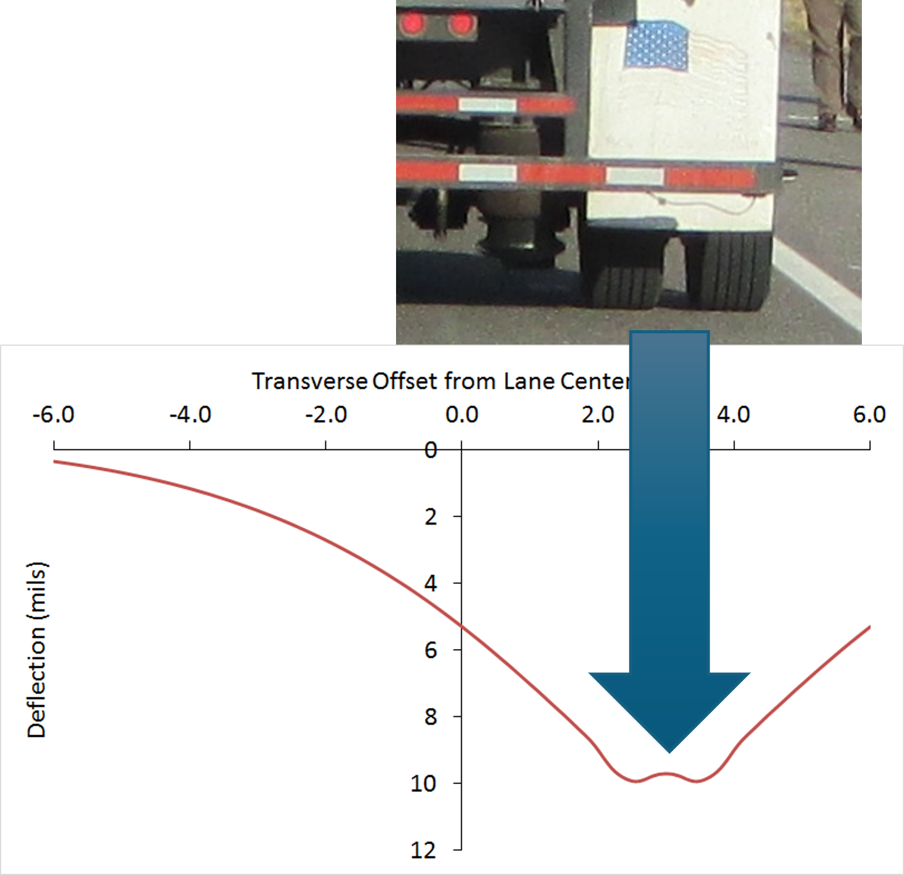{width="90%"
}

**Figure 7. Simulated response under dual tires showing interaction
(w-shaped deflection).**

But that is not the end of the story. The 2 tires shown in Figures 6 and
7 only correspond to one half of the full axle (i.e., half-axle). There
are 2 more tires on the other side! Figure 8 shows the full-axle with 4
tires and the influence zones (again, the influence zones are
over-simplified here) from all tires. See where the interactions occur?
Again, the dual tires on each side of the axle start interacting within
the AC. But more importantly for this figure, the 2 half-axles start
interacting within the subgrade layer.

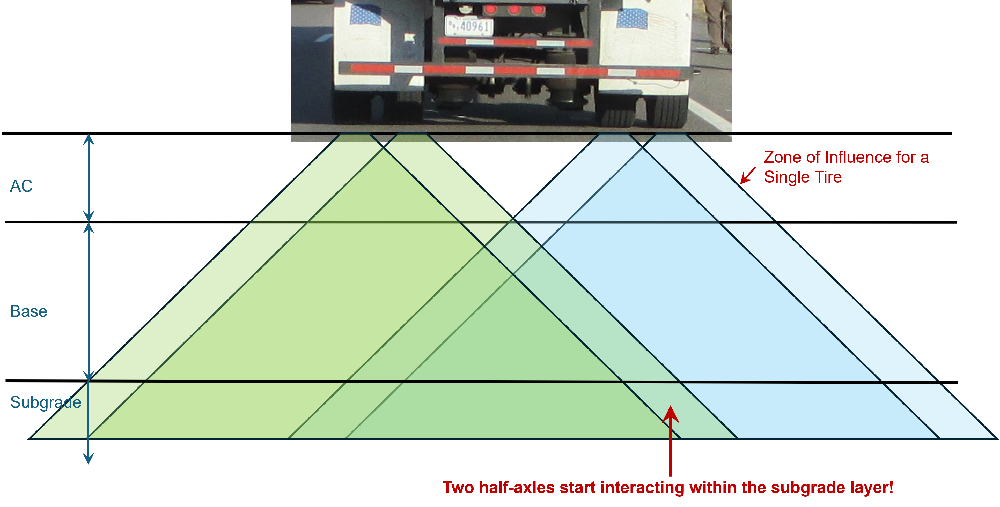{width="6.9in" height="3.5in"}

**Figure 8. Interaction of dual tires due to influence zone
overlapping.**

So, what happens due to this interaction between the 2 half-axles? As
shown in Figure 9, the overall response or deflection under this
full-axle, when plotted along the transverse direction, shows a much
larger "W" shape. Fortunately or unfortunately, given the typical
configuration of modern truck/trailer systems and the typical pavement
thicknesses we have nowadays, this interaction between the 2 half-axles
is almost always going to occur in the subgrade layer.

So, what's the catch here? The TSDDs are generally instrumented on one
side of the vehicle (i.e., on one of the half-axles). However, it
doesn't mean it is only measuring the response under that instrumented
half-axle. The instrumentation feels the entire axle due to the
interaction. This significance or the degree of this interaction is
largely dependent on the subgrade because that's where the interaction
occur!

On the flip side, FWD is always applied on a single plate. So, there is
no interaction from multiple loads whatsoever. So, the discrepancies
that you see in Figures 6 and 7 between the FWD and TSDD deflections are
primarily caused by the subgrade where the interaction between the 2
half-axles take place.

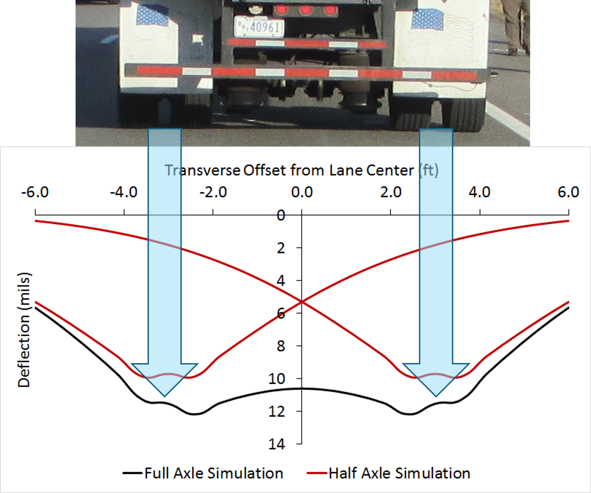{width="90%"
}

**Figure 9. Interaction of dual tires due to influence zone
overlapping.**

[**MYTH #1 VERDICT --- BUSTED!**]{.darkred}

{width="5.0in"
}

::: {.callout-note .myth-verdict appearance="simple" icon=false}

**MYTH #1 IS BUSTED!**

Myth #1 is busted if the assumption is that TSDD and FWD deflections can be directly correlated through one general relationship. The simulations clearly show that the relationship is strongly influenced by the underlying pavement system, particularly the subgrade where the interaction between the 2 half-axles occurs. In order to generate a relationship between FWD and TSDD deflections across different pavements, we may need additional insights from physics or other mechanistic methods to properly address the difference between a single load (FWD) and multiple loads (TSDD). Remember, it is all about the **SUBGRADE**.

:::

## 4. Myth #2 --- TSD deflection slopes can be integrated to provide deflections

This statement almost sounds trivial mathematically. The deflection
slope is nothing but the derivative of the deflection, *D*(*x*), with
respect to *x*. Therefore, calculus says we can simply differentiate the
deflection curve to obtain the slope curve we want. Mathematically, this
relationship is written as the following.

$$
S(x) = \frac{\partial D(x)}{\partial x}
$$ {#eq-slope-derivative}

Yes, it is true. As illustrated in Figure 10, if you start with a known
deflection curve, you will end up with a unique slope curve. But does it
work the other way around?

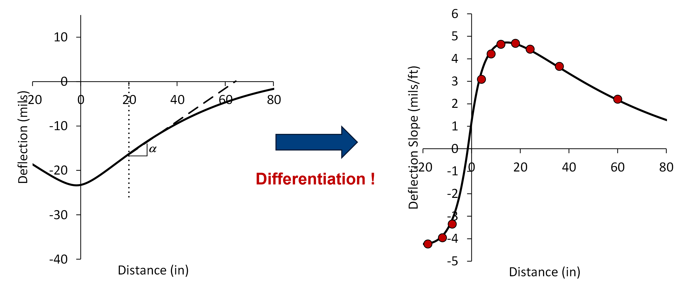{width="90%"
}

**Figure 10. Differentiation of a deflection curve always results in a
unique slope curve.**

Well, all we had to do to obtain the slope curve from a deflection curve
was to differentiate the deflection curve. **So, all we have to do to
obtain the deflection curve from a slope curve is to integrate the slope
curve. Right...?** [**The answer is no, No, NO, and Hell NO!**]{.darkred}

Recall from your calculus class\... When you integrate a function
mathematically, it always comes with an "Integration Constant". So, the
correct mathematical notation for integrating the slope curve to obtain
the deflection curve, is given as the following.

$$
D(x) = \int S(x)\,dx + C
$$ {#eq-deflection-integration}

where *C* is the unknown integration constant. What does this mean? It
means we can end up with an infinite number of deflections unless we
know what the *C* value is specifically. This is illustrated in Figure
11. All of the 3 deflection curves shown on the right-hand-side came
from the single slope curve shown on the left-hand-side. Depending on
the value of *C*, the integrated deflection curve can be placed anywhere
in the vertical direction. So, which one is the correct deflection for
us to use? The answer is none of them because we do not know the *C*
value.

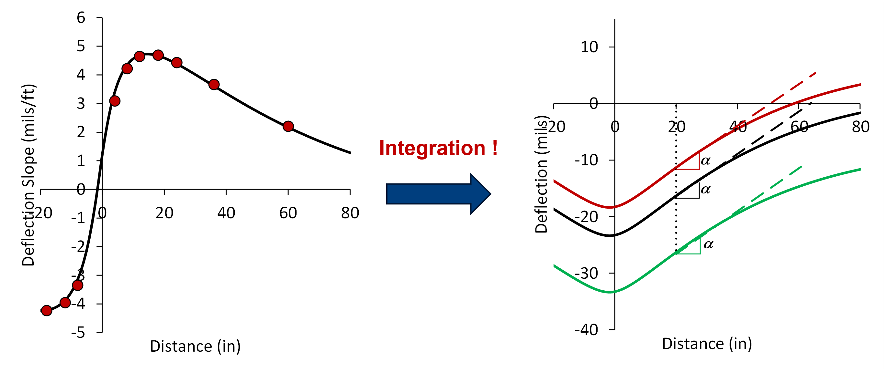{width="90%"
}

**Figure 11. Integration of a deflection slope curve results in an
infinite number of deflection curves.**

### 4.1 The reference-sensor assumptions

Well... If we do not know the integration constant *C* we need for
integration, how are we integrating the slope to get the deflections
from TSD?

One thing we also need to discuss before the integration process is that
all TSDs have one or more "Reference Doppler Sensor(s)". The Reference
Sensor measurement is subtracted from all other doppler measurements,
and it is not reported to the end user. I do not want to dive too deep
into this, but let's just say this is needed to correct for the vehicle
motion (i.e., so that we can see the pavement response rather than the
vehicle response). Most of the recent TSDs have this reference sensor
located at approximately 121.0 in. from the instrumented axle (i.e.,
*x*~ref~ = 121 in).

There are 2 primary assumptions behind how the slopes are being
integrated today. These assumptions are mathematically expressed as the
following.

$$
D\left(x_{\mathrm{ref}}\right) = 0
$$ {#eq-zero-deflection}

and

$$
S\left(x_{\mathrm{ref}}\right) = 0
$$ {#eq-zero-slope}

Yes, that's just me trying to look fancy with those equations. All in
all, it only means that both the deflection (@eq-zero-deflection) and the
deflection slope (@eq-zero-slope) are assumed to be ZERO at the reference
sensor location.

So, how is the integration carried out and what is the effect of the
above assumptions? For those of you that want to learn more, I made a
separate graphic on this topic which you can download from my
ResearchGate site:
[TSD_Integration](https://www.researchgate.net/publication/412295281_Everything_you_need_to_know_about_Traffic_Speed_Deflectometer_TSD_deflections_integrated_from_deflection_slopes_Current_Practice).
We will keep the discussion here relatively brief and focus on the
consequences of the above assumptions.

The Zero-Deflection assumption in @eq-zero-deflection basically shifts the
entire deflection curve up or down such that the deflection at the
reference sensor location crosses the x-axis. This is illustrated in
Figure 12. I am going to call this the "Shifting Error".

[***The absolute deflections (e.g., D0, D8, ... , D72) you get from
integrated TSD deflections are always affected by this "Shifting
Error"!***]{.darkred}

One thing to note about the shifting error is that it does not affect
some of the frequently used Deflection Basin Parameters (DBPs). As an
example, the Surface Curvature Index (SCI) which is defined as D0 --
D12, is clearly not affected by this shifting error because both the D0
and D12 get shifted by the same amount, and the shifting error naturally
cancels out in the calculation.

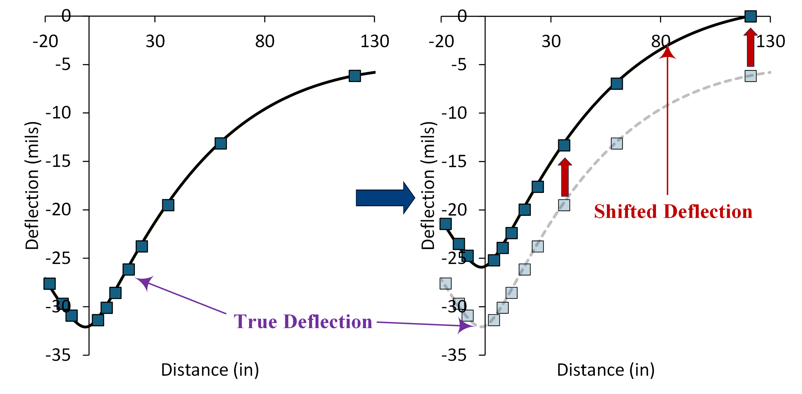{width="90%"
}

**Figure 12. Zero-deflection assumption shifts the entire deflection up
or down.**

The Zero-Slope assumption in @eq-zero-slope rotates the entire deflection
curve about the reference sensor location, forcing the non-zero slope at
the reference sensor location to become zero. This is illustrated in
Figure 13 and I will call this the "Rotation Error".

Unlike the shifting error, this rotation error affects everything
including the DBPs. Going back to the DBP example we had up there, the
D0 and D12 needed for calculating the SCI are not shifted by the same
amount when this rotation happens.

[***The "Rotation Error" affects EVERYTHING including absolute
deflections (e.g., D0, D8, ... , D72) and relative deflections or
Deflection Basin Parameters (DBPs)!***]{.darkred}

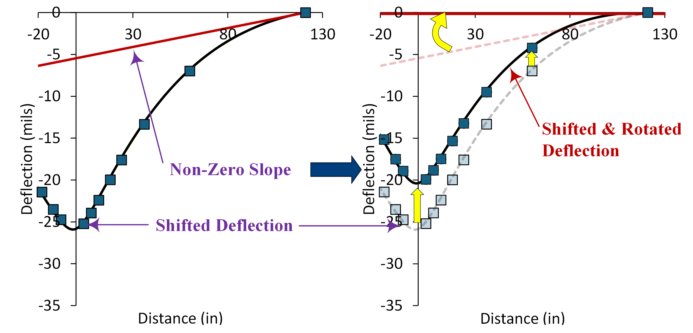{width="90%"
}

**Figure 13. Zero-slope assumption rotates the deflection about the
reference sensor location.**

### 4.2 Can the integration be improved?

Do you believe in the Zero-Deflection assumption in @eq-zero-deflection and/or
the Zero-Slope assumption in @eq-zero-slope?\... I do NOT! Well... then is
there a different way we could integrate the deflection slopes?
Possibly!

Again, because I do not believe that both the deflection and deflection
slope should be zero at the reference sensor location, I decided to try
something slightly different. First, I wanted to recover (if possible)
the non-zero slope at the reference sensor location and second, I wanted
to assume that the deflection was zero further away from the TSD axle.

These thoughts led me to what I would call a "Two-step Cubic Hermite
Spline Fitting" procedure. Sounds fancy but it only means that I am
doing the cubic spline fitting twice. This process is graphically
illustrated in Figure 14.

1.  The first spline is fitted through the measured slopes plus another
    location further away from the reference sensor (say 400 in.) where
    the slope is assumed to be zero. The only purpose of this first
    spline is to estimate the nonzero slope at the reference sensor.

2.  The non-zero slope at the reference sensor location estimated from
    the first spline is added to all of the measured slopes (because
    this value was subtracted during measurement).

3.  A second spline is then fitted through the corrected slopes and the
    estimated slope at the reference sensor. The location where the
    slope was assumed to be zero during the first spline fitting (again,
    say 400 in. to be consistent with what I had in Step 1) is also
    included. This second spline is used for numerically integrating the
    deflection slope.

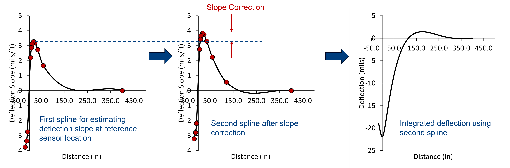{width="90%"
}

**Figure 14. Two-step cubic Hermite spline concept used to estimate the
reference sensor slope before integration.**

So essentially, I used a different location for the zero-deflection and
zero-slope assumption. The above text shows I used 400 in. for this new
location, but I actually used several different locations at 172, 300,
400, and 500 in. were tested. The 172 in. location may sound like a
weird location, but it is the location that is halfway between the
driving axle and the TSD axle for ARRB's most recent TSD configuration.
In any rate, all these "new reference locations" resulted in similar
results, so I will only provide those from 400 in. as the new reference
location.

Here is an animation that compares the true (i.e., the 1,770 DSteele
deflections obtained from Myth #1 along with the current integration
practice and my "NEW" integration process described above.



**Animation 3. Conventional vs. new integration method
([Animation_3_LinkedIn_Post](https://lnkd.in/p/eWTGWn_g)).**

I hope the above animation gave you enough evidence, but if not...
Figure 15 shows a typical outcome of what was in the animation. The new
method (two-step spline method) improved both the slope and the
integrated deflection, meaning that it helped the results get closer to
the true results (which in this case was DSteele results for the 1,770
pavements simulated herein). But looking at the integrated deflection
results, this is not acceptable. Again, I am only showing you the
results from the new reference location being at 400 in., but trying
different reference locations (from 172 in. to 500 in.) did not improve
this any further, and in fact, many of those actually got worse -- Mark
my words for this!

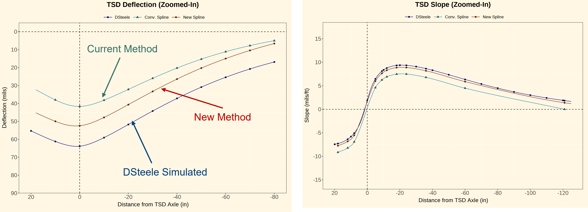{width="90%"
}

**Figure 15. Screenshot of Animation 3. Closeup and frozen view of
deflection and slope.**

[**MYTH #2 VERDICT --- ABSOLUTELY BUSTED!**]{.darkred}

{width="5.0in"
}

::: {.callout-note .myth-verdict appearance="simple" icon=false}

**MYTH #2 IS BUSTED!**

[**Myth #2 is absolutely busted if you are relying on purely mathematical integration of TSD deflection slope.**]{.darkred} This is mainly because [**there is no way for us to recover the information that has already been lost**]{.darkred}: the non-zero slope and non-zero deflection at the reference sensor location. Trying different reference locations may help a little, but it is still a wild "guess".

If you still want to integrate the TSD deflection slope to obtain the deflection... maybe you will need some additional guidance from "Physics" or "Mechanics".

Also remember that the current integration scheme for TSD deflection slope will always give you 2 different errors.

1. [**Shifting Error**]{.darkred} resulting from the Zero-Deflection assumption. This will not affect some of the DBPs (e.g., SCI) that describe the "shape" of the deflection basin.

2. [**Rotation Error**]{.darkred} resulting from the Zero-Slope assumption. [**THIS AFFECTS EVERYTHING**]{.darkred}.

Remember that the **subgrade** modulus is one of the most important parameters in conventional flexible pavement design. The subgrade modulus is typically estimated from the deflection that is measured at certain distances (typically between 36 in. and 60 in.) from the load. The integrated deflection you get from TSD is affected by both shifting and rotation errors.

:::

## 5. Myth #3 --- You MUST consider all TSDD axles (or tires) in your model

The above myths dealt with 2 fundamental questions: (1) how TSDD
response differs from FWD response and (2) whether the TSD deflection
slopes can be integrated to provide absolute deflections. The third myth
turns to a more practical modeling question.

***When we simulate a TSDD, do we really need to model the entire truck
and trailer?***

At this point, I would like to emphasize that this myth is limited to
forward simulation only. Backcalculation is a different problem, and we
will deal with that separately in Myth #4.

The motivation for asking the above question is primarily due to
computational efficiency. A full TSDD model (i.e., truck and trailer)
will contain multiple axles and many individual tire loads. If our
primary interest is the pavement response near the instrumented TSD
axle, it is tempting to ask whether we can simply model that axle and
ignore the rest of the vehicle. A reduced model can be considerably more
efficient, particularly when thousands of forward simulations are
required for sensitivity studies, optimization, backcalculation
development, or even AI/ML training.

But Myth #1 already gave us a reason to be cautious. We saw that
pavement response is not controlled only by what happens directly
beneath an individual tire (or half-axle). Stress and deformation fields
spread through the pavement structure, and their interaction can become
especially important in the deeper layers. In fact, the interaction
between the two half-axles was one of the reasons the relationship
between FWD and TSDD deflection became strongly dependent on the
subgrade. In Myth #3, I am asking essentially the same question at a
larger spatial scale. How much do the other axles of the TSDD influence
the response measured near the TSDD axle?

### 5.1 Can We Simulate Only the TSD Axle?

Figure 16 shows an example comparison of the deflections obtained from a
single tire and the full TSD models. You can clearly see the deflections
due to the additional axles (i.e., steering and driving axles) within
the full TSD model that are not present in the single axle model. The
more important observation, however, is what happens near the TSD axle
itself. The two deflection curves are not identical, but they seem
really close to one another. Right?

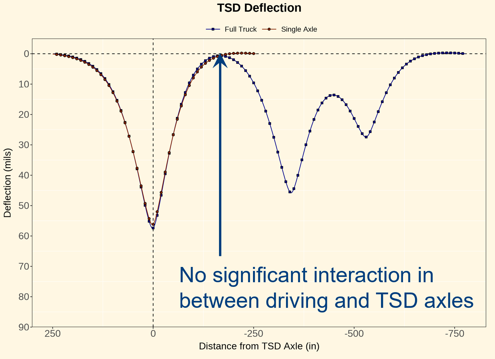{width="90%"
}

**Figure 16. Deflections from single axle and full TSD models with
minimal interaction between TSD axles.**

The results shown in Figure 16 may seem encouraging for the single-axle
approximation at first glance. If the response around the measurement
axle is nearly the same, why can't we ignore all the other axles and
save some time in running those simulations? Well... the particular
example shown in Figure 16 shows minimal interaction between different
axles of the TSD. The real problem is that the amount of interaction is
not always minimal like the one shown in Figure 16. As the pavement
structure changes and the amount of interaction becomes more significant
between different axles, the influence of the driving axle(s) on the
response near the TSD axle also changes.

For most pavements, the interaction between different axles becomes much
more noticeable than what is shown in Figure 16. See Figure 17 as an
example which shows some significant interaction between the TSD axles.
You can clearly see that the deflection from the single axle model may
not be as good as what it was in Figure 16. Once again, it is the
pavement structure, particularly the deeper supporting layers, that
controls how broadly the response from one axle spreads before it begins
interacting with the response from another axle.

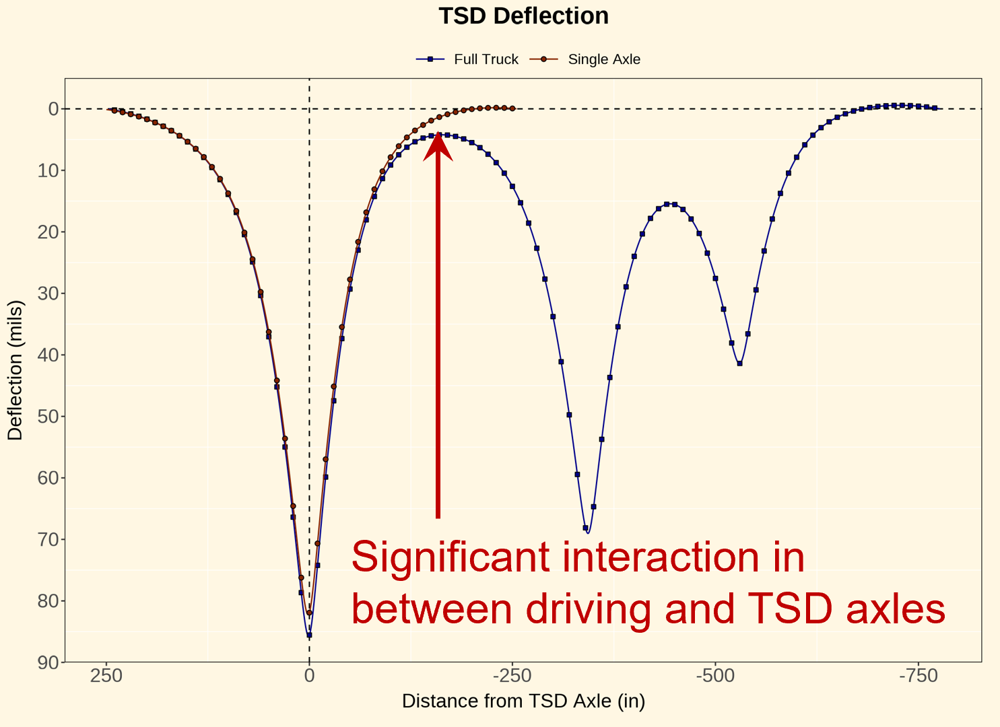{width="90%"
}

**Figure 17. Deflections from single axle and full TSD models with
significant interaction between TSD axles.**

So, Myth #3 is not asking whether the additional axles produce their own
deflection basins because they obviously do. The question is whether the
additional axles of the TSDD affect the response at the location we have
the TSDD measurement system, and, if they do, whether the resulting
error is large enough to matter for the intended application.

### 5.2 Quantifying the Forward-Simulation Error

For this Myth, I used the same 1,770 pavement structures I had in Myth
#1 and simulated each structure twice, first with the full TSDD vehicle
and again using only the TSDD axle. This provides a very clean way for
me to compare the deflections from both models directly (or
side-by-side). Here is the animation that shows the deflections from all
1,770 pavement structures.



**Animation 4. Full TSD vs. single-axle forward simulation
([Animation_4_LinkedIn_Post](https://lnkd.in/p/e3YNZ2iU)).**

I hope the animation helped you to see that sometimes the single axle
model may be just fine where as some other times, it is just not good
enough. Well then, the next question we need to ask is how do these
deflections and deflection slopes between the 2 models actually compare?

Figure 18 shows the 1:1 comparison of the deflections at different
offsets from the axle. Looks pretty good, right? Then what about the
actual error? Figure 19 shows the percent error that I calculated for
different offsets from the TSDD axle. Looking at this figure, I would
say that the error from the single axle model mostly ranged from −5.0%
to +10.0% over the locations evaluated. One thing to note here, a
negative error means that the single-axle simulation is overpredicting
the corresponding full-truck response. The 1:1 comparisons (Figure 18)
show that the two simulations remain strongly related, but the error
distributions (Figure 19) make it clear that the single-axle solution is
not identical to the full-truck solution.

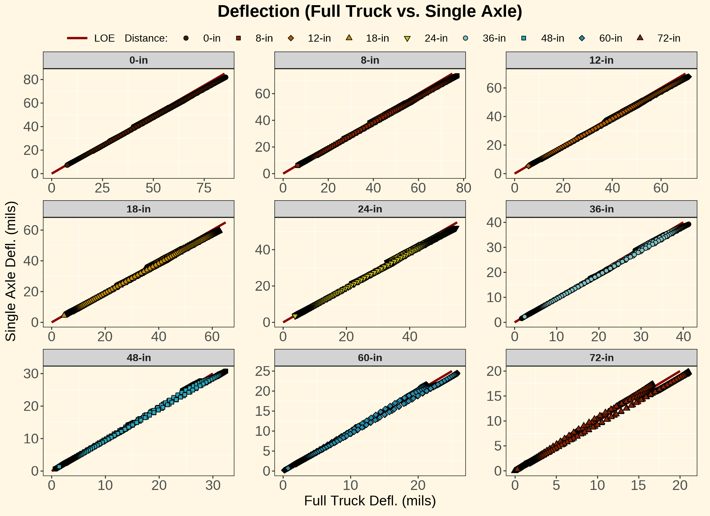{width="90%"
}

**Figure 18. Comparison of single axle vs full TSD model deflections at
different offsets.**

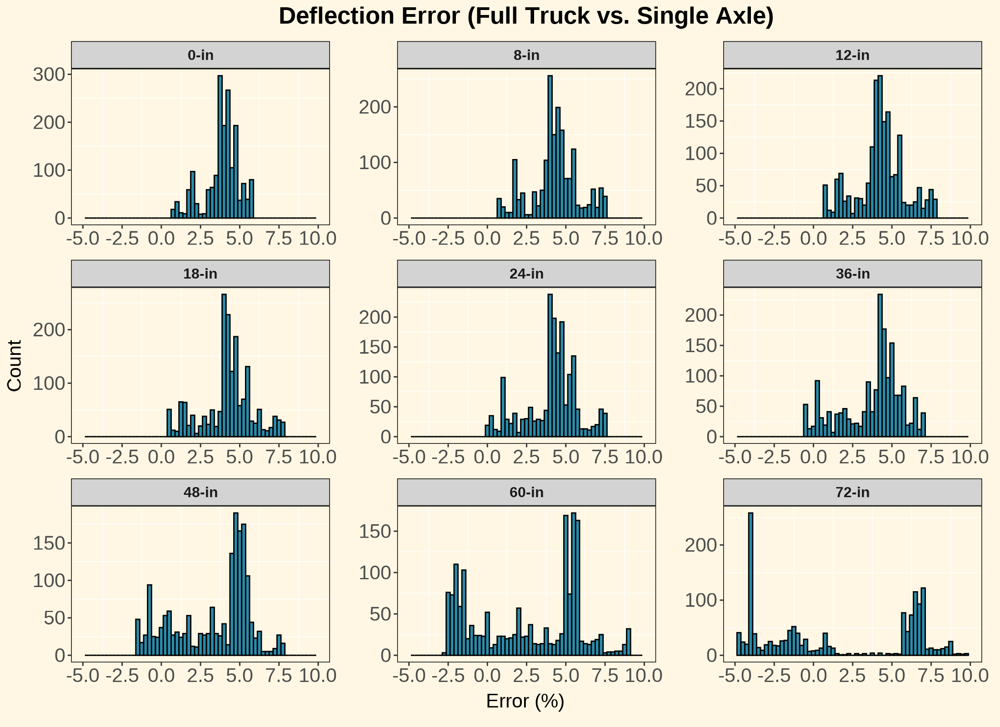{width="90%"
}

**Figure 19. Deflection error observed from single axle modeling.**

The same comparison was made using TSD deflection slope. See Figure 20
for the 1:1 comparisons of the deflection slope and Figure 21 for the
resulting errors. For the TSD configuration evaluated here, the single
axle model resulted in deflection slope error mostly between −4% and
+10%.

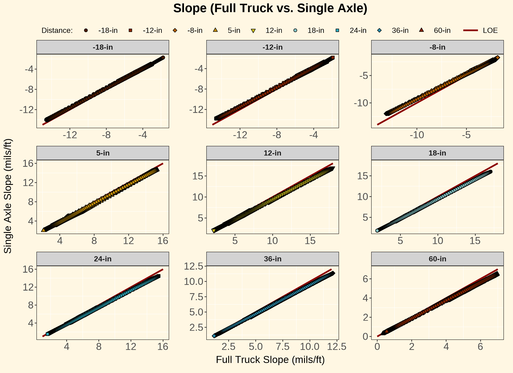{width="90%"
}

**Figure 20. Comparison of single axle vs full TSD model deflection
slopes at different offsets.**

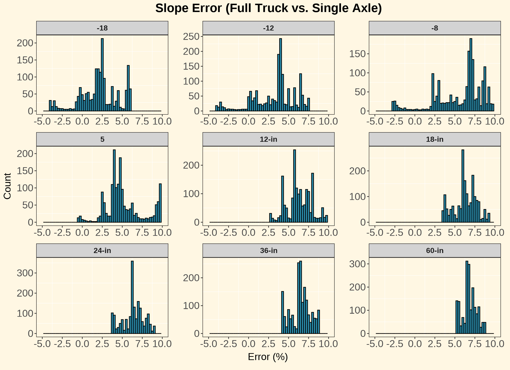{width="90%"
}

**Figure 21. Deflection slope error observed from single axle
modeling.**

[**MYTH #3 VERDICT --- CONFIRMED / PLAUSIBLE**]{.darkred}

{width="5.0in"
}

**This myth is CONFIRMED if the objective is to avoid the simplification
error or if you are not willing to tolerate any error.**

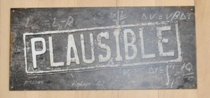{width="5.0in"
}

**This myth is PLAUSIBLE if a quantified amount of error is acceptable
in exchange for computational efficiency.**

::: {.callout-note .myth-verdict appearance="simple" icon=false}

**MYTH #3 IS CONFIRMED/PLAUSIBLE!**

**Do we really need to model all axles and tires of the TSDD? The answer depends on what you are trying to accomplish?**

[**If you are not willing to tolerate any modeling error associated with axle simplification, then the myth is CONFIRMED.**]{.darkred} In this case, you need to simulate the full TSD or, at a minimum, the TSD axle and the driving axle(s) that may influence the measured response.

But engineering models are almost always a compromise between fidelity and efficiency. [**If an error of the magnitude observed here is acceptable for the intended application, then a single-axle model can be a useful approximation. In that case, the myth becomes PLAUSIBLE**]{.darkred} rather than universally confirmed.

So, I would encourage you to ask yourself what you are trying to do with your forward models. Depending on what your goal is... instead of simply asking yourself "Can I simplify the TSDD to one axle?", the better question might be:

**How much modeling error am I willing to tolerate for the computational efficiency I gain?**

Before I finish my thoughts on this myth, I also need to make one thing very clear. The errors I showed you in this myth should not be taken as universal error bounds for every TSDD. ARRB, Greenwood, Falkor, ICC-IMS, and other systems such as Raptor use different axle spacings, axle loads, tire configurations, and vehicle geometries. The interaction between axles, and therefore the error associated with reducing the vehicle to a single axle, should be evaluated separately for the specific device and application.

:::

## 6. Myth #4 --- TSD deflection slopes can be used for backcalculating layer moduli, including subgrade modulus

Finally, the first three myths have led us toward this myth.

Myth #1 showed that the subgrade plays a major role in the relationship
between impact loading and moving load response. In addition, Myth #1
showed that TSDD deflections are not well correlated to FWD deflections.

Remember that the subgrade modulus is one of the most important
parameters for pavement design. However, Myth #2 showed that we cannot
get the absolute deflections (which we need for estimating the subgrade
modulus) by integrating the TSD slopes mathematically.

Myth #3 then showed that simplifying the full TSD vehicle to a single
axle during modeling introduces errors in both deflection and slope.

So perhaps we should take a different route, rather than keep trying to
get the "absolute deflections" from TSD by integrating the slopes or
trying to correlate the TSD deflections to those from FWD.

***What if we just use the deflection slope itself?***

More specifically, the question we want to ask is if the TSD slopes
contain enough structural information for us to backcalculate the
pavement layer moduli---including the subgrade modulus? And, based on
what we learned in Myth #3, what happens to the backcalculated results
if we simplify the forward model to a single TSD axle?

### 6.1 The Reference Sensor and the Offset Slope

There is one thing I need to emphasize before we talk about
backcalculation. As I discussed in Myth #2, the measurement from the
reference doppler laser is subtracted from those of all other dopplers
to remove the vehicle motion from the measurements. The reported slope
response is therefore relative to that reference measurement rather than
an untouched absolute pavement slope. See Figure 22 for an illustration.

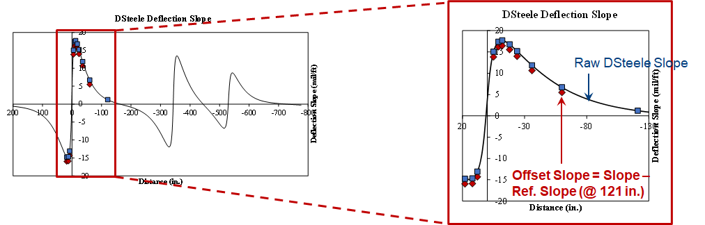{width="90%"
}

**Figure 22. Illustration of offset slope (= Slope -- Reference
Slope).**

So, to be consistent with what the TSD is actually doing, I have used
the offset slope for backcalculation herein. Mathematically, the offset
slope, *S~offset~*, is nothing but the following.

$$
S_{\mathrm{Offset}}(x) = S(x) - S\left(x_{\mathrm{ref}}\right)
$$ {#eq-offset-slope}

One more thing I would like to ask the TSD community.

**For future development including mechanistic backcalculation,
optimization, and AI/ML surrogate models... I recommend treating offset
slope as the response quantity rather than the raw slopes you get from
your models. That is what the equipment is doing, so why wouldn't you
account for it in your model?**

### 6.3 The Backcalculation Experiment

The same 1,770 synthetic pavement structures used in the previous myths
were used for this myth again. Because the true AC, base, and subgrade
moduli were known for every structure, the backcalculated moduli could
be compared directly to their "true" values.

Two separate backcalculation efforts were conducted. First, the complete
TSD vehicle was represented in the forward model for backcalculation.
Second, the forward model was simplified to the single TSD axle and the
backcalculation was conducted again. One thing to note is that only one
set of seed moduli was used for all 1,770 × 2 backcalculations. This is
worth emphasizing because the initial guesses were not tuned separately
for individual pavement structures. The backcalculation results, or more
specifically the layer moduli as well as the backcalculated deflections
and slopes, are shown in the following animation.

This animation seems to be "glitching"? Don't worry. There is nothing
wrong with your computer or your smartphone. It is just due to the
inherent error in backcalculation.



**Animation 5. Full TSD vs single axle backcalculation results
([Animation_5_LinkedIn_Post](https://lnkd.in/p/ee9gn2FX)).**

### 6.4 Full Truck Backcalculation Results

The full-truck results were quite encouraging. The true vs.
backcalculated layer moduli are shown in Figure 23 and the distribution
of errors are shown in Figure 24.

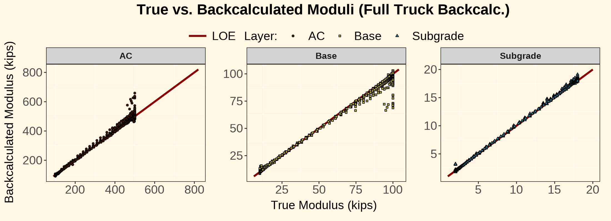{width="90%"
}

**Figure 23. True vs. backcalculated modulus (Full truck model).**

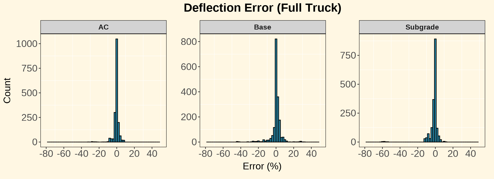{width="90%"
}

**Figure 24. Backcalculation error (Full truck model).**

The backcalculated AC, base, and subgrade moduli generally tracked the
known target values closely, with errors mostly within approximately
±5%. Most importantly for the central question in this myth, the
subgrade modulus was recoverable from the offset-slope response along
with the upper pavement layer moduli.

This is significant because Myth #2 showed that absolute deflection
cannot be obtained from TSD slope through purely mathematical
integration alone. Yet the inability to reconstruct the unique, absolute
deflection does not mean that the slopes lost their structural
information. The backcalculation results seem to show that the
offset-slope pattern itself contains information that can be used to
assess pavement layer properties.

### 6.5 Single Axle Backcalculation Results

The single axle backcalculation tells a slightly different story. The
true vs. backcalculated layer moduli are shown in Figure 25 and the
distribution of errors are shown in Figure 26. Both these figures
immediately show that the results were not as good as the full truck
case.

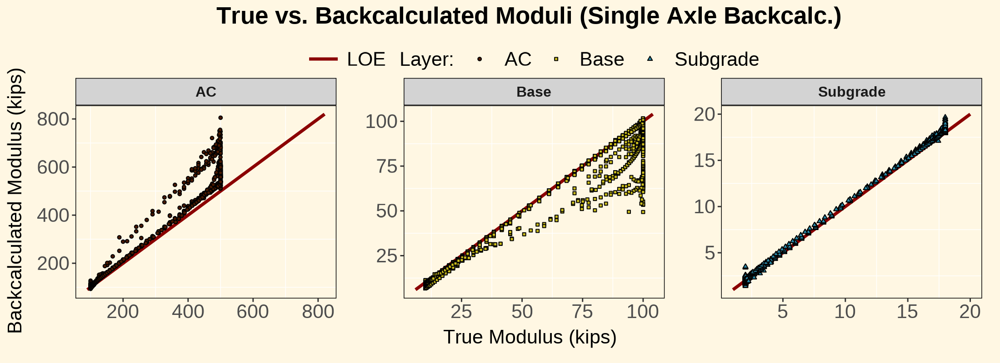{width="90%"
}

**Figure 25. True vs. backcalculated modulus (Single axle model).**

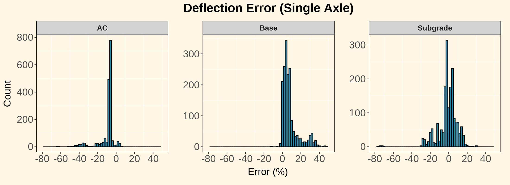{width="90%"
}

**Figure 26. Backcalculation error (Single axle model).**

While the full truck backcalculation errors were mostly within
approximately ±5%, the single axle backcalculation produced errors that
were mostly within ±20%.

This is an important extension of Myth #3. A forward simulation error of
several percent may appear relatively modest when we are simply
comparing deflection or slope. But backcalculation is an inverse
problem. Small differences in the modeled response can propagate into
much larger differences in the material properties required to reproduce
the response. In other words, the simplification error in the forward
simulation does not necessarily remain in the range when we go to
backcalculation.

The result therefore reinforces the importance of matching the forward
model to the actual TSDD configuration when the objective is structural
backcalculation. A reduced single axle model may still be useful, but
the computational savings come with a much larger uncertainty in the
backcalculated layer moduli.

### 6.6 An Important Clarification: This does Not mean ±5% backcalculation error when we use field data

The full-truck result needs one very important clarification. The ±5%
error observed here should not be interpreted as evidence that TSD
backcalculation with field data will produce backcalculated pavement
moduli within ±5%.

The results I showed you here are controlled synthetic, matched-model
backcalculations. The pavement response was generated using the same
general theoretical framework used in the backcalculation analysis, the
layer thicknesses were known without errors, and the true moduli were
known exactly. Under these conditions, the study primarily tests whether
the offset-slope response contains sufficient information for
backcalculating the input properties.

Field measurements introduce additional sources of uncertainty that are
not represented in this synthetic experiment such as measurement noise,
load and speed variation, pavement temperature, uncertainty in layer
thickness, viscoelasticity of AC, nonlinear or stress-dependent unbound
materials, and other device- and site-specific effects.

So the conclusion from this myth is not to say that TSD backcalculation
with field data can be performed with about ±5% error. The conclusion is
narrower and, I think, more importantly at this stage (under a
controlled mechanistic framework), TSD offset slope contains sufficient
information to recover the AC, base, and subgrade moduli. Field
validation is the next step.

[**MYTH #4 VERDICT --- CONFIRMED / PLAUSIBLE**]{.darkred}

{width="5.0in"
}

**For full truck matched-model synthetic backcalculation, Myth #4 is
CONFIRMED. The TSD offset slopes contained sufficient structural
information to backcalculate the AC, base, and subgrade moduli, with
errors mostly within approximately ±5% for the 1,770 pavement structures
evaluated here.**

{width="5.0in"
}

**For single axle backcalculation, the myth is PLAUSIBLE at best. The
recovered moduli showed substantially greater error, mostly within ±20%.
Whether that level of error is acceptable depends on the intended
application and your engineering judgement.**

::: {.callout-note .myth-verdict appearance="simple" icon=false}

**MYTH #4 IS CONFIRMED/PLAUSIBLE!**

TSD slope does not have to be treated merely as an intermediate quantity that must be converted into absolute deflections for further analysis. The offset slope can be treated directly as the measurement domain for backcalculation. The full truck slope-based backcalculation successfully recovered all three pavement layer moduli including the subgrade within ±5% error.

**The TSD measures deflection slopes (or velocities to be more exact), NOT deflections. Why not use what was measured by the equipment?**

:::

## 7. The Four-Myth Scorecard

Taken together, I hope the 4 myths tell you a connected story about how
TSD measurements should be interpreted and modeled.

Myth #1 showed that TSDD and FWD responses are not simply
interchangeable. Myth #2 showed that although TSD measures deflection
slope, absolute deflections cannot be obtained through purely
mathematical integration without additional, mechanistic- or
physics-based guidance. Myth #3 then moved to forward simulation and
showed that simplifying the TSDD vehicle to a single axle can provide
substantial computational efficiency, but at the cost of increased
error. Finally, Myth #4 showed why that distinction becomes even more
important in backcalculation -- a relatively modest error in forward
simulation can translate into a considerably larger error in the
backcalculated layer properties.

Collectively, these results point to a common lesson: TSD slope is a
structurally informative measurement in its own right, but extracting
reliable pavement properties from it may require a more mechanistic
framework that properly represents the pavement system, the measurement
reference, and the loading configuration.

**Table 3. Summary of the 4 myths discussed in this article.**

  -----------------------------------------------------------------------
  **Myth**                **Verdict**             **Main takeaway**
  ----------------------- ----------------------- -----------------------
  Myth #1: FWD and TSDD   BUSTED                  A single direct
  deflections correlate                           relationship is not
  well                                            generally transferable;
                                                  subgrade condition
                                                  strongly affects the
                                                  relationship.

  Myth #2: TSD slopes can BUSTED                  Unconstrained
  be integrated                                   integration alone
  mathematically to                               cannot uniquely recover
  provide deflection                              absolute deflection;
                                                  shifting and rotation
                                                  errors matter.

  Myth #3: All TSDD axles CONFIRMED / PLAUSIBLE   Full-truck modeling
  and tires must be                               gives highest fidelity;
  modeled for forward                             single-axle modeling
  simulation                                      may be acceptable when
                                                  quantified error is
                                                  tolerable.

  Myth #4: TSD deflection CONFIRMED / PLAUSIBLE   Matched-model synthetic
  slopes can be used for                          full-truck inversion
  backcalculating layer                           recovered all layer
  moduli                                          moduli well;
                                                  single-axle
                                                  simplification
                                                  increased error.
  -----------------------------------------------------------------------

## 8. Engineering Implications

These myths suggest that TSD analysis should be approached as a moving
load mechanics problem, rather than a "high-speed analogue of FWD". That
distinction has practical consequences for both interpretation of TSD
measurements and development of forward and inverse analysis methods.

-   FWD and TSDD measurements may correlate under defined conditions,
    but that relationship should not be assumed to remain transferable
    across pavement structures, particularly when subgrade conditions
    change.

-   TSD deflection slope may contain useful structural information in
    its own right. Converting slope measurements to absolute deflection,
    however, requires additional information or constraints beyond pure
    mathematical integration.

-   Reduced axle representations can provide substantial computational
    efficiency, but the resulting approximation error should be
    quantified for the specific TSDD configuration, pavement conditions,
    and intended application.

-   For backcalculation, offset deflection slopes should be treated as
    the equivalent of measured responses.

The broader implication is that TSD slope does not necessarily need to
be converted into an FWD-like deflection basin before it becomes useful
for pavement evaluation. A mechanistic model that directly predicts the
quantities measured by the TSD provides an alternative path: compare
measured and predicted slopes in their native form and use those
responses directly for structural inference.

## 9. Limitations and Next Steps

The analyses presented in this article are primarily theoretical and
computational. They were intentionally designed to isolate individual
mechanics and modeling assumptions so that their effects could be
examined independently. Consequently, the results should not yet be
interpreted as validation of a complete field-ready TSD backcalculation
framework.

The most important next step is field validation. In particular, the
slope-based backcalculation approach should be evaluated using measured
TSD data from pavement sections for which layer thicknesses and material
properties have been characterized. Such comparisons would provide a
much stronger conclusion on whether the structural information
demonstrated in the synthetic analyses can be extended to field
conditions.

Several additional effects should also be investigated, including
viscoelasticity of AC layer, nonlinear or stress-dependent behavior of
unbound materials, temperature, dynamic axle loading, measurement noise,
and device-specific sensor locations and geometry. These factors were
intentionally excluded from the analyses presented here.

The conclusions regarding reduced axle configurations should likewise be
regarded as configuration-specific rather than universal. The magnitude
and spatial distribution of approximation error depend on axle spacing,
axle loads, sensor offsets, pavement structure, and the particular TSDD
platform. Comparable sensitivity analyses should therefore be performed
before adopting a reduced loading representation for another device or
application.

## 10. Closing Thoughts

The four myths explored in this article began as separate technical
problems, several of which first appeared in my individual LinkedIn
posts. I hope putting these together reveals a more coherent story about
how TSD measurements should be interpreted and modeled.

Perhaps the simplest way to summarize the four myths is this: [**TSDD is
not an FWD traveling at highway speed.**]{.darkred} Although both devices are used
to characterize pavement structural response, the loading mechanisms,
measurement quantities, and underlying mechanics are fundamentally
different. Those differences should be recognized rather than treated as
complications to be removed.

That, to me, is the most useful outcome of this exercise. The purpose is
not simply to label the myths as *Confirmed*, *Busted*, or
*Plausible* for the sake of a *Mythbusters*-style scorecard. It is to
understand why an assumption works, where it begins to break down, and
what the underlying pavement mechanics are telling us.

The four myths therefore point toward a broader principle for TSD
analysis: [**work as closely as possible with the physics of the
measurement itself.**]{.darkred} Instead of forcing TSD measurements into the
framework of an FWD test, the analysis should recognize the moving load
system, the vehicle configuration, the measurement reference, and the
response quantities that the TSDD actually measures. Or, stated more
simply:

[**Don't interpret TSD by asking how closely it can imitate FWD.
Interpret TSD based on the mechanics of what TSD actually measures.**]{.darkred}

## 11. References

1.  Lee, H.S. and Steele, D. Dynamic Backcalculation of Asphalt Pavement
    Properties and Simulation of Pavement Response under Moving Loads.
    Transportation Research Board 96^th^ Annual Meeting. Washington,
    D.C. 2017.

2.  Steele, D., Lee, H.S., Beckemeyer, C., and Van, Thomas. Moving Wheel
    versus Impact Deflections and Their Use in Pavement Evaluation.
    Transportation Research Record. 2021. DOI: 10.1177/03611981211028859
